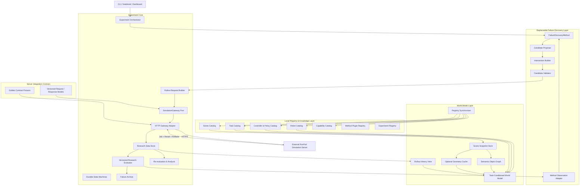

# Failure-Seeking Robot Research Platform — Client Architecture

> **문서 버전:** v0.3
>
> **대상:** MacBook 기반 Research Client / Failure-Seeking Control Plane
>
> **연결 대상:** 이미 운영 환경이 구성된 외부 RunPod Simulation Execution Server
>
> **주요 로봇:** Unitree G1
>
> **주요 시뮬레이터:** MuJoCo
>
> **설계 전제:** 로봇 실패 사례 탐색 방법론은 아직 확정되지 않았으며, 연구 진행 중 반복적으로 교체·조합·확장될 수 있다.
> **구현 범위:** 이 저장소는 Client만 구현한다. Server 내부 runtime·GPU worker·MuJoCo 실행기는 구현하지 않는다.

---

## 0. 이번 개정의 핵심

이 문서는 Client를 단순한 API 호출 프로그램이 아니라 다음 역할을 수행하는 **연구 제어 계층**으로 재정의한다.

1. **Scene·Robot·Controller·Policy 정보를 로컬 catalog로 동기화**
2. **task-conditioned world model을 구성하여 failure 탐색에 사용**
3. **교체 가능한 failure-discovery methodology를 실행**
4. **실험 protocol, candidate, rollout, 평가 결과와 provenance를 장기적으로 관리**
5. **외부 RunPod Server를 안정적인 gateway 뒤에 격리하고 실행을 재시도·복구**

중요한 책임 분리는 다음과 같다.

```text
RunPod Server
= 실제 simulation asset과 runtime의 authoritative source of truth
= Client가 호출하는 외부 시스템이며 이 저장소의 구현 대상이 아님

MacBook Client
= 연구 방법론, 탐색 전략, 실험 제어와 분석의 source of truth
= 이 저장소의 유일한 제품 구현 범위
```

Client에도 scene/robot registry가 필요하지만, Server registry를 복제하는 것이 아니라 **추론과 탐색에 필요한 lightweight local mirror/catalog**를 유지한다.

## 0.1 이번 개정에서 확정한 범위

이 저장소에서 구현하는 것은 다음이다.

- Server API contract와 `SimulationGateway`
- registry/capability local mirror
- experiment protocol, lock, orchestration, resume
- failure-discovery method와 candidate/intervention 생성
- raw result/artifact 수집과 무결성 검증
- versioned evaluation, failure archive, 분석 UI

다음은 구현하지 않는다.

- MuJoCo/G1 runtime과 controller/policy adapter
- GPU worker, queue, renderer, Server-side registry/storage
- RunPod 배포와 Server 운영 코드

단, Client가 의존하는 request/response, 상태, 오류, retry/idempotency 규칙은 이 문서에서 명확하게 고정한다. `SERVER_ARCHITECTURE.md`는 외부 시스템의 참고 문서이며 이 저장소의 구현 backlog가 아니다.

---

# 1. 연구 목표와 아키텍처 목표

## 1.1 연구 목표

이 시스템의 최종 목적은 특정 한 가지 adversarial search 알고리즘을 구현하는 것이 아니다.

목적은 다음 질문을 반복적으로 연구할 수 있는 기반을 만드는 것이다.

> 주어진 3D scene, robot, controller/policy, task 조건에서 로봇이 언제, 왜, 어떤 방식으로 실패하는가?

연구 과정에서 아래 방법들이 독립적으로 또는 조합되어 사용될 수 있다.

- random/domain randomization
- grid, Latin hypercube, Sobol sampling
- Bayesian optimization
- CMA-ES 및 black-box optimization
- hierarchical semantic-to-parametric search
- coverage-guided exploration
- novelty search
- LLM 기반 failure hypothesis generation
- surrogate-assisted search
- active learning
- counterexample-guided refinement
- failure boundary search
- failure case minimization 또는 delta debugging
- 사람 연구자의 수동 가설 기반 탐색

따라서 Client architecture는 특정 방법 이름을 core domain model에 고정하지 않는다.

## 1.2 아키텍처 목표

- 새로운 methodology를 core code 수정 없이 plugin으로 추가
- failure definition과 failure score를 experiment별로 변경
- 같은 rollout raw data를 새로운 evaluator로 재평가
- scene/robot/policy revision을 포함한 정확한 재현
- 한 실험에서 여러 방법론을 공정하게 비교
- method state를 checkpoint하고 중단 후 resume
- failure가 발견된 뒤 재현성 확인, 경계 탐색, 최소화 수행
- simulation error와 실제 robot-policy failure를 구분
- 전체 scene 파일을 매 rollout마다 전송하지 않고 structured intervention만 전송

---

# 2. 핵심 설계 원칙

## 2.1 Research Methodology Independence

Core Client는 다음만 알아야 한다.

```text
현재 연구 상태
    ↓
Method가 candidate 제안
    ↓
candidate를 Server 실행 요청으로 변환
    ↓
결과 관찰
    ↓
Method state 업데이트
```

Core는 candidate를 어떤 방식으로 만들었는지 알 필요가 없다.

Method는 HTTP endpoint, 인증 token, polling, artifact download를 알지 못한다. 이 책임은 Core와 `SimulationGateway`가 가진다.

## 2.2 External Server Behind a Stable Gateway

RunPod Server는 Client 관점에서 외부 시스템이다. Client domain code는 Server SDK나 HTTP response에 직접 의존하지 않고 다음 port에만 의존한다.

```python
class SimulationGateway(Protocol):
    def get_capabilities(self) -> "CapabilitySnapshot": ...
    def get_registry_snapshot(self) -> "RegistrySnapshot": ...
    def get_scene_snapshot(self, ref: "SceneRef") -> "SceneSnapshot": ...
    def query_scene(self, request: "SceneQueryRequest") -> "SceneQueryResult": ...
    def submit_rollout(
        self,
        request: "RolloutRequest",
        idempotency_key: str,
    ) -> "RolloutAccepted": ...
    def get_rollout_status(self, job_id: str) -> "RolloutStatus": ...
    def get_rollout_result(self, job_id: str) -> "RolloutResult": ...
    def cancel_rollout(self, job_id: str) -> "CancelResult": ...
    def download_artifact(self, ref: "ArtifactRef") -> "LocalArtifact": ...
```

실제 연결은 `HttpSimulationGateway`, 단위·방법론 테스트는 `FakeSimulationGateway`를 사용한다.

## 2.3 Authoritative Remote Registry + Local Research Catalog

- Server: 실제 asset, MuJoCo model, controller/policy runtime 관리
- Client: Server metadata와 analysis snapshot을 local catalog/cache로 관리
- 모든 catalog entry는 remote revision을 포함
- 새 revision 발견 시 `latest` projection만 stale 처리
- 실험에 고정된 과거 revision cache는 삭제하지 않고 계속 참조 가능하게 유지

## 2.4 Raw Evidence와 Derived Judgment 분리

다음은 서로 다른 데이터로 저장한다.

```text
Raw evidence
- state trajectory
- action trajectory
- contact events
- observations
- policy outputs
- video
- termination facts

Derived judgment
- task failure 여부
- failure type
- severity
- root-cause hypothesis
- novelty score
- 연구용 failure score
```

Derived judgment에는 항상 evaluator ID와 version을 기록한다. 따라서 방법론이나 failure definition이 바뀌어도 기존 raw rollout을 다시 평가할 수 있다.

## 2.5 Failure와 Infrastructure Error 분리

아래는 연구 대상 failure가 아니다.

- invalid scene
- MuJoCo compile error
- renderer crash
- model weight load failure
- controller exception
- GPU out-of-memory
- network timeout

이들은 `ExecutionError`로 기록하며 robot failure archive에 자동 포함하지 않는다. 단, policy 자체의 유효한 출력이 잘못된 경우와 policy adapter/model loading이 실패한 경우를 구분한다. 전자는 연구 대상 failure가 될 수 있고 후자는 infrastructure error다.

## 2.6 Immutable Experiment Provenance

실험 실행 후 아래 값은 수정하지 않는다.

- protocol snapshot
- method plugin/version/config/source hash
- registry revisions
- candidate/intervention
- rollout request
- raw result
- evaluator/version/definition hash
- random seed와 seed 파생 알고리즘
- Client commit, dependency lock hash, contract version
- canonical request/result/artifact hash

변경이 필요하면 기존 실험을 수정하지 않고 **branch experiment**를 만든다.

## 2.7 Capability Negotiation

Client는 현재 Server가 어떤 기능을 제공하는지 시작 시 조회한다.

- scene query types
- intervention types
- robot/controller/policy profiles
- sensor/render options
- artifact formats
- maximum episode duration
- schema versions

Method가 요구하는 capability가 없으면 실험 시작 전에 차단한다.

---

# 3. 전체 Client 아키텍처



`SimulationGateway`는 Client domain과 외부 Server 사이의 anti-corruption layer다. Method, evaluator, archive는 HTTP status나 Server DTO를 직접 다루지 않는다. Server API 변화는 contract model과 `HttpSimulationGateway` 안에서 흡수한다.

---

# 4. Client와 Server의 책임 경계

| 항목 | MacBook Client | RunPod Server |
|---|---|---|
| 연구 질문 및 hypothesis | 소유 | 알 필요 없음 |
| failure-discovery method | 소유 | 알 필요 없음 |
| 실험 protocol | 소유 | 실행 metadata로 보관 |
| Scene 원본 asset | 선택적 analysis copy | authoritative |
| Scene local catalog | 소유/cache | metadata 제공 |
| Robot profile local catalog | 소유/cache | authoritative profile 제공 |
| Controller/policy catalog | 소유/cache | 실제 runtime 제공 |
| Task-conditioned world model | 소유 | query facts 제공 |
| Candidate 생성 | 소유 | 수행하지 않음 |
| Intervention 생성 | 소유 | 검증 및 적용 |
| 최종 collision/compile 검증 | approximate만 | authoritative |
| Physics rollout | 수행하지 않음 | 수행 |
| 원시 metric/event | 수신·보관 | 계산 |
| 연구용 failure label | 계산/버전 관리 | 선택적 표준 event만 제공 |
| Failure archive/ranking | 소유 | 수행하지 않음 |
| Video | 다운로드·분석 | 생성 |
| Reproduction evidence | 보관·요청 | runtime provenance 생성 |

이 표의 Server 열은 Client가 기대하는 외부 동작만 기술한다. 해당 동작의 Server-side 구현은 이 저장소 범위 밖이다.

---

# 5. Local Registry & Catalog 설계

Client에는 다음 catalog가 필요하다.

```text
LocalRegistry
├── SceneCatalog
├── RobotProfileCatalog
├── ControllerCatalog
├── PolicyCatalog
├── TaskSchemaCatalog
├── CapabilityCatalog
├── MethodPluginRegistry
└── ExperimentRegistry
```

## 5.1 SceneCatalog

SceneCatalog는 Server에 등록된 scene의 lightweight mirror이다.

### 저장 정보

- `scene_id`
- `scene_revision`
- name/description
- coordinate system, unit, bounds
- semantic object summary
- region summary
- spawn points
- cameras
- available analysis assets
- supported queries
- allowed interventions
- last synchronized time
- local cache state

### 저장하지 않아도 되는 정보

- full-resolution visual mesh
- textures 전체
- compiled MuJoCo binary
- controller runtime asset

단, methodology가 local geometry를 요구하면 simplified GLB, point cloud, occupancy map, nav mesh 등을 선택적으로 다운로드한다.

### 핵심 interface

```python
class SceneCatalog:
    def list(self) -> list["SceneRecord"]: ...
    def get(self, scene_id: str) -> "SceneRecord": ...
    def upsert_remote(self, record: "SceneRecord") -> None: ...
    def mark_stale(self, scene_id: str, new_revision: str) -> None: ...
    def require_revision(self, scene_id: str, revision: str) -> None: ...
```

## 5.2 RobotProfileCatalog

Failure hypothesis에 필요한 robot 특성과 runtime capability를 보관한다.

### 예시 정보

- robot geometry envelope
- standing/base height
- body width
- foot dimensions
- joint/DOF summary
- nominal control frequency
- controller profiles
- policy profiles
- supported high-level commands
- observation/sensor requirements
- known operational limits
- profile revision

Client는 이 정보를 사용해 다음과 같은 hypothesis를 만들 수 있다.

```text
passage clearance
< robot effective width + margin

step height
≈ controller의 취약 경계

target orientation
→ turning instability 가능성
```

단, catalogue 수치는 research prior 또는 metadata이며 실제 가능/불가능 여부는 rollout으로 검증해야 한다.

## 5.3 ControllerCatalog / PolicyCatalog

Robot과 controller/policy를 분리한다.

```text
Robot = physical embodiment
Controller = low-level locomotion/whole-body control
Policy = high-level action selection or VLA
```

각 profile은 다음을 포함한다.

- stable ID
- revision/hash
- compatible robot IDs
- supported task/action spaces
- required observation
- configurable parameters
- deterministic level
- model/runtime constraints

## 5.4 TaskSchemaCatalog

Methodology가 navigation만 가정하지 않도록 task를 schema로 관리한다.

초기 task:

- stand
- move with velocity command
- navigate to pose
- approach object
- reach object
- grasp/release — 향후
- composite task — 향후

## 5.5 CapabilityCatalog

`GET /api/v1/capabilities` 결과를 저장한다.

Client contract는 다음 key를 사용한다. Server 응답을 이 이름으로 정규화한 뒤 local catalog에 저장한다.

```text
contract_versions
scene_queries
intervention_operations
recording_channels
artifact_formats
render_profiles
robots/controllers/policies/tasks
limits
```

Method plugin은 시작 전에 문자열 존재 여부뿐 아니라 필요한 operation/channel version과 필드를 선언한다.

```python
required_capabilities = MethodRequirements(
    contract_version=">=1.0,<2.0",
    scene_queries=(QueryRequirement("get_clearance", version="1.x"),),
    intervention_operations=(
        OperationRequirement("add_primitive", version="1.x", features={"shape": "box"}),
    ),
    recording_channels=(
        RecordingRequirement(
            "state_trajectory",
            required_fields=("timestamp_s", "base_pose", "joint_positions"),
        ),
        RecordingRequirement("contact_events"),
    ),
)
```

ExperimentOrchestrator가 Server capability와 비교해 fail-fast한다. compatibility 결과에는 boolean뿐 아니라 누락된 capability, version mismatch, 지원하지 않는 field/limit을 구조화해 기록한다. 당시 capability snapshot과 compatibility result는 protocol lock에 포함한다.

## 5.6 Registry Synchronizer

동기화 흐름:

```text
GET /api/v1/registry/snapshot
    ↓
remote IDs/revisions 비교
    ↓
new/changed entries fetch
    ↓
local catalogs update
    ↓
new revision의 latest projection만 stale 처리
```

모든 cache key는 최소한 `(resource_id, immutable_revision, asset_or_query_type, implementation_version, parameters_hash)`를 포함한다. 새 revision이 발견되어도 실행 중이거나 과거 실험에 고정된 revision cache는 삭제하지 않는다.

권장 명령:

```bash
failure-client registry sync
failure-client registry status
failure-client registry show scene scene_001
```

## 5.7 Scene 최초 등록과 Client의 역할

정상 연구 workflow에서 Client는 Server에 이미 `READY`로 등록된 scene을 동기화한다.

새 scene을 넣을 때는 Client repository 안에 선택적인 `SceneIngestionClient`를 둘 수 있다.

```text
Mac local scene package
    ↓ upload/submit
Server validates and registers
    ↓ READY + revision
Client SceneCatalog sync
```

즉 Client가 등록 요청을 시작할 수는 있지만, **등록의 최종 권한과 validation은 Server**에 있다.

---

# 6. Scene Snapshot과 Task-Conditioned World Model

## 6.1 Scene Snapshot

Client 추론용 snapshot은 Server authoritative registry에서 생성된다.

```json
{
  "schema_version": "1.0",
  "scene_id": "scene_001",
  "scene_revision": "sha256:...",
  "coordinate_system": {
    "up_axis": "Z",
    "unit": "meter"
  },
  "bounds": {},
  "objects": [],
  "regions": [],
  "spawn_points": [],
  "cameras": [],
  "query_capabilities": [],
  "intervention_capabilities": []
}
```

Snapshot은 raw mesh보다 안정적이고 methodology-independent한 representation이다.

## 6.2 Semantic Object Graph

예:

```text
robot_spawn
  ├─ near → table_01
  ├─ connected_by_path → target_region
  └─ blocked_by → chair_03

chair_03
  ├─ category → chair
  ├─ movable → true
  └─ intersects_candidate_path → true
```

Object graph는 반드시 완벽할 필요가 없으며, methodology별로 필요할 때 생성한다.

## 6.3 Optional Geometry Cache

다음 analysis asset은 선택적으로 local cache에 둔다.

- simplified scene mesh
- point cloud
- occupancy grid
- height map
- navigation mesh
- signed distance field
- object AABB/OBB collection

원본 scene revision이 변경되면 관련 geometry cache를 폐기한다.

## 6.4 Task-Conditioned World Model

Agent에 항상 전체 scene을 주지 않고 task와 현재 hypothesis에 관련된 subset을 구성한다.

### 입력

```text
TaskSpec
+ RobotProfile
+ Controller/PolicyProfile
+ SceneSnapshot
+ Dynamic scene queries
+ Previous rollout history
```

### 출력 예시

```json
{
  "task": "navigate_to_pose",
  "robot_profile": "unitree_g1_groot_default@sha256:...",
  "relevant_objects": ["doorway_01", "chair_03", "target_marker"],
  "candidate_paths": [],
  "clearance_summary": {},
  "terrain_summary": {},
  "known_failure_regions": [],
  "uncertain_regions": []
}
```

---

# 7. Methodology-Agnostic Failure Discovery Framework

## 7.1 최상위 interface

```python
from typing import Protocol

class FailureDiscoveryMethod(Protocol):
    plugin_id: str
    plugin_version: str

    def requirements(self) -> "MethodRequirements": ...
    def initialize(self, context: "MethodContext") -> None: ...
    def propose(self, budget: int) -> list["CandidateProposal"]: ...
    def observe(self, observations: list["CandidateObservation"]) -> None: ...
    def should_stop(self) -> "StopDecision": ...
    def state_dict(self) -> dict: ...
    def load_state_dict(self, state: dict) -> None: ...
```

Method는 Server API를 직접 호출하지 않는다. Method는 candidate만 제안하고 Core Orchestrator가 검증·실행한다. `CandidateObservation`은 정상 evaluation, validation rejection, indeterminate result, infrastructure error를 구분한다. `state_dict()`에는 optimizer뿐 아니라 RNG state와 다음 sequence index를 포함한다.

## 7.2 MVP 소유권과 확장 원칙

첫 vertical slice에서는 지나친 framework 일반화를 피한다. 소유권은 다음과 같이 고정한다.

```text
Method plugin
- candidate 제안
- 관찰 결과를 이용한 내부 모델 업데이트
- 방법론 내부 수렴 판단
- serializable checkpoint state

Core Client
- Server query/API 호출
- candidate/intervention schema validation
- rollout scheduling, budget, retry, cancellation
- 공식 ResearchEvaluation의 append-only 저장
- archive 저장과 experiment-level stop
- checkpoint/observation 반영의 transaction 경계
```

`ResultEvaluator`를 method 내부에 넣지 않는다. Core의 versioned `ResearchEvaluator`가 공식 evaluation을 만들고, method는 필요하면 `ObservationAdapter`를 통해 acquisition용 objective로 변환한다. `ArchiveStore`는 Core가 소유하고 archive selection 전략만 나중에 plugin으로 확장한다.

Random/Sobol/기존 AFS/LAM-guided가 이 interface로 동작한 이후에만 다음 component 분해를 C7에서 검토한다.

```text
QueryPlanner / CandidateProposer / InterventionBuilder
ObservationAdapter / ArchiveSelectionPolicy / ConvergencePolicy
```

Adaptive Server query가 필요한 고급 method도 gateway를 직접 호출하지 않는다. Method가 `SceneQueryRequest`를 action으로 반환하면 Orchestrator가 실행하고 versioned query result를 observation으로 돌려주는 방식으로 확장한다.

## 7.3 CandidateProposal

Method output은 특정 MuJoCo 구현이 아니라 연구 수준의 candidate다.

```json
{
  "candidate_id": "cand_0018",
  "method_instance_id": "method_004",
  "hypothesis": {
    "mechanism": "Narrow lateral clearance may destabilize turning.",
    "target_entities": ["doorway_01"],
    "confidence": 0.61
  },
  "intervention_intent": {
    "family": "scene_geometry",
    "operation": "narrow_passage",
    "parameters": {
      "effective_clearance_m": 0.44
    }
  },
  "requested_queries": [],
  "parent_candidate_ids": [],
  "tags": ["clearance", "locomotion", "turning"]
}
```

`InterventionBuilder`가 이를 Server contract인 `InterventionSpec`으로 변환한다.

## 7.4 기본 제공 methodology

### Baseline A — Random/Domain Randomization

목적:

- end-to-end 검증
- 비교 가능한 baseline
- search bias가 없는 coverage 확인

### Baseline B — Sobol/Grid Search

목적:

- 저차원 parametric space의 systematic coverage
- reproducible sequence

### Method C — Black-box Optimization

- Bayesian optimization
- CMA-ES
- Optuna sampler

단일 failure score에만 묶지 않고 multi-objective를 허용한다.

### Method D — Hierarchical Search

```text
failure family
→ semantic factor
→ object/region
→ intervention family
→ continuous parameters
```

기존에 논의한 Hierarchical Adversarial Environment Search는 이 plugin 중 하나로 구현한다. 전체 시스템 자체가 이 방법에 종속되지는 않는다.

### Method E — Coverage/Novelty Guided

state, event 또는 scene factor coverage를 최대화한다.

### Method F — LLM Hypothesis Guided

LLM은 다음을 제안한다.

- suspected mechanism
- relevant entities
- intervention family
- safe parameter range
- expected evidence

LLM이 raw MJCF를 직접 생성하지 않는다.

### Method G — Surrogate-Assisted

이전 rollout으로 failure probability 또는 severity를 근사하고 acquisition function으로 다음 candidate를 선택한다.

### Method H — Failure Minimization

이미 발견된 failure에서 불필요한 intervention을 제거하여 더 단순하고 해석 가능한 counterexample을 만든다.

---

# 8. Failure의 데이터 모델

“실패”를 하나의 boolean으로만 표현하지 않는다.

## 8.1 네 계층

### A. Execution Validity

```text
VALID_EXECUTION
INVALID_SCENE
COMPILE_ERROR
CONTROLLER_ERROR
POLICY_ERROR
RENDER_ERROR
WORKER_ERROR
```

### B. Task Outcome

```text
SUCCESS
FAILURE
INDETERMINATE
```

### C. Observed Failure Events

예:

- robot fall
- severe collision
- no progress
- timeout
- oscillation
- unsafe joint limit event
- target not reached
- object dropped
- forbidden contact
- perception loss — 관측 가능할 때
- planning deadlock — 관측 가능할 때

### D. Research Interpretation

예:

- terrain-induced locomotion failure
- narrow-clearance turning failure
- perception-driven failure
- policy generalization failure
- controller robustness failure

D는 자동 label이 아니라 hypothesis일 수 있으며 confidence와 evaluator version을 기록한다.

## 8.2 FailureDefinition

Experiment마다 교체 가능한 schema다.

```json
{
  "failure_definition_id": "fd_nav_v3",
  "version": "3.0",
  "task_outcome_rule": {
    "type": "target_distance",
    "success_threshold_m": 0.35
  },
  "event_rules": [
    {
      "event_type": "ROBOT_FALL",
      "base_height_below_m": 0.55,
      "tilt_above_deg": 55.0,
      "grace_period_s": 0.3
    },
    {
      "event_type": "NO_PROGRESS",
      "window_s": 4.0,
      "minimum_progress_m": 0.05
    }
  ],
  "aggregation": {
    "type": "multi_objective",
    "objectives": [
      "task_failure",
      "fall_severity",
      "collision_impulse",
      "time_to_failure"
    ]
  }
}
```

## 8.3 Derived Evaluation은 append-only

같은 rollout을 새 FailureDefinition으로 평가할 때 기존 label을 덮어쓰지 않는다.

```text
rollout_001
├── evaluation fd_nav_v1
├── evaluation fd_nav_v2
└── evaluation fd_nav_v3
```

---

# 9. Intervention 모델

Failure research가 obstacle placement에만 제한되지 않도록 generic intervention을 사용한다.

```text
InterventionSpec
├── SceneIntervention
├── TaskIntervention
├── RobotInitialStateIntervention
├── DynamicsIntervention
├── SensorIntervention
├── ControllerConfigIntervention
└── PolicyConfigIntervention
```

Wire contract에서는 이 분류를 설명용 문자열이 아니라 `kind`로 구분되는 discriminated union으로 정의한다. 모든 operation은 다음 공통 필드를 가진다.

```json
{
  "operation_id": "op_001",
  "kind": "scene.add_primitive",
  "operation_version": "1.0",
  "coordinate_frame": "scene",
  "parameters": {},
  "depends_on": []
}
```

- pose와 vector에는 coordinate frame과 unit을 명시한다.
- operation ordering은 배열 순서와 `depends_on`으로 결정한다.
- 같은 entity/property를 수정하는 충돌 규칙을 contract에 정의한다.
- canonical JSON과 SHA-256을 저장해 duplicate detection과 idempotency에 사용한다.
- Client validation은 approximate이고 Server의 authoritative validation result를 원본 그대로 보관한다.

## 9.1 Scene Intervention

- add/move/rotate/scale/remove object
- material/friction 변경
- lighting 변경
- visibility/occlusion 변경
- primitive 또는 mesh 추가
- terrain 변경
- doorway/clearance 변경

## 9.2 Task Intervention

- target pose 변경
- instruction paraphrase
- time budget 변경
- task sequence 변경
- success tolerance 변경

## 9.3 Robot Initial State Intervention

- spawn pose
- initial yaw
- initial joint state
- initial velocity
- payload

## 9.4 Dynamics Intervention

- friction
- mass
- damping
- actuator latency/noise
- external disturbance — simulation only

## 9.5 Sensor Intervention

- camera pose
- noise
- latency
- dropped frame
- field of view
- partial occlusion

## 9.6 Controller/Policy Configuration

- high-level command frequency
- controller gain profile
- policy temperature 또는 inference option
- execution horizon

모든 intervention type은 Server capability가 지원할 때만 사용한다.

---

# 10. Experiment Protocol

## 10.1 Protocol이 포함해야 하는 것

- research question
- hypothesis
- scene/robot/controller/policy references
- task definition
- methodology plugin and version
- method config
- search space
- failure definition
- repeat policy
- seed policy
- artifact policy
- budget
- stop condition
- exclusion rule
- analysis plan
- provenance metadata

`failure definition`, method config, intervention builder config는 ID/version만 참조하지 않고 canonical content hash를 protocol lock에 포함한다. 재평가에 필요한 recording channel은 evaluator requirements에서 역산해 실험 시작 전에 capability와 함께 검증한다.

## 10.2 예시

```yaml
schema_version: "1.0"

experiment:
  experiment_id: "exp_g1_nav_failure_001"
  title: "G1 navigation failure discovery in scene_001"
  parent_experiment_id: null
  research_question: >
    Which scene configurations cause reproducible navigation failures
    for the selected Unitree G1 controller?
  hypothesis: null

resources:
  scene:
    id: "scene_001"
    revision: "sha256:..."
  robot:
    id: "unitree_g1"
    profile: "default"
    revision: "sha256:..."
  controller:
    id: "groot_locomotion"
    revision: "git:..."
  policy:
    id: "scripted_navigation"
    revision: "git:..."

task:
  schema: "navigate_to_pose@1.0"
  parameters:
    target_position_m: [3.0, 0.0, 0.0]

method:
  plugin_id: "sobol_parametric"
  plugin_version: "0.1.0"
  config:
    parameter_space:
      obstacle_x: [0.8, 2.5]
      obstacle_y: [-0.8, 0.8]
      obstacle_height: [0.05, 0.35]

failure_definition:
  id: "fd_nav_v1"
  version: "1.0"

execution:
  candidate_budget: 200
  repeats_per_candidate: 3
  master_seed: 101
  seed_policy: "sha256(master_seed, candidate_canonical_hash, repeat_index)-v1"
  maximum_parallel_jobs: 1

artifacts:
  trajectory: "always"
  events: "always"
  video: "always"  # MVP; 이후 trajectory 기반 deferred rendering으로 최적화
  policy_trace: "always"
```

연구용 failure label은 Client가 rollout 종료 후 계산하므로 Server가 사전에 `on_failure`를 판단할 수 없다. MVP vertical slice는 video를 항상 요청한다. 저장 비용 최적화가 필요하면 모든 renderable trajectory를 보존하고 Client 판정 후 별도 rendering을 요청하는 contract를 후속으로 추가한다.

## 10.3 Experiment Branching

방법론이 변경되면:

```bash
failure-client experiment branch \
  exp_g1_nav_failure_001 \
  --new-id exp_g1_nav_failure_002 \
  --replace-method llm_hierarchical@0.2
```

공통 parent protocol과 변경 diff를 모두 저장한다.

---

# 11. Experiment Orchestrator

## 11.1 상태 머신

Experiment 상태와 candidate repeat별 remote rollout 상태를 분리한다. 하나의 전역 선형 상태로 여러 job의 부분 완료를 표현하지 않는다.

### Experiment state

```text
CREATED
→ SYNCING_REGISTRY
→ VALIDATING_PROTOCOL
→ BUILDING_WORLD_MODEL
→ INITIALIZING_METHOD
→ RUNNING_SEARCH
→ COMPLETED

예외:
→ PAUSED
→ FAILED
→ CANCELLED
```

### Rollout attempt state

```text
CREATED
→ SUBMIT_PENDING
→ SUBMITTED
→ REMOTE_RUNNING
→ RESULT_AVAILABLE
→ DOWNLOADING_ARTIFACTS
→ INGESTED
→ EVALUATED

예외:
→ RETRY_PENDING
→ REMOTE_FAILED
→ INFRASTRUCTURE_ERROR
→ CANCEL_REQUESTED
→ CANCELLED
```

Client polling timeout은 Server job cancellation을 의미하지 않는다. 통신이 복구되면 저장된 `job_id`를 다시 조회한다.

## 11.2 주요 책임

- registry revision 고정
- capability validation
- method plugin load
- candidate budget 관리
- duplicate candidate detection
- rollout submission
- retry/idempotency
- result ingestion
- evaluator 실행
- archive update
- method checkpoint
- stop policy
- resume
- branch provenance

### Durable submission 순서

```text
canonical rollout request 생성
→ request hash와 idempotency key를 local DB에 commit
→ POST /rollouts
→ returned job_id를 commit
→ poll/result/artifact ingest
→ evaluation과 method observation 기록
→ method checkpoint commit
```

POST 직후 Client가 종료돼도 동일 idempotency key로 재제출해 기존 job을 회수한다. Result ingest와 evaluation은 중복 호출돼도 동일 record를 반환하는 idempotent operation이어야 한다. method observation cursor와 checkpoint는 같은 transaction 경계에서 갱신해 동일 결과를 두 번 학습하지 않도록 한다.

## 11.3 반복 실행과 재현성

Candidate 하나를 여러 seed로 실행할 수 있다.

```text
candidate
├── repeat 0 / derived seed
├── repeat 1 / derived seed
└── repeat 2 / derived seed
```

Seed는 `master_seed`, canonical candidate hash, repeat index를 versioned 알고리즘으로 조합해 파생한다. candidate ID 문자열이나 Python의 process-randomized `hash()`를 사용하지 않는다.

Failure case는 단일 실패가 아니라 다음 통계를 포함한다.

- failure rate
- event distribution
- severity distribution
- time-to-failure
- confidence interval
- deterministic/reproducible 여부

`INVALID_EXECUTION`, `INDETERMINATE`, infrastructure error는 failure-rate 분모에 자동 포함하지 않고 별도 count로 보고한다. estimator와 confidence interval 방식도 evaluation definition에 versioned metadata로 기록한다.

---

# 12. Failure Archive

## 12.1 FailureCaseRecord

```json
{
  "failure_case_id": "fc_00042",
  "experiment_id": "exp_g1_nav_failure_001",
  "candidate_id": "cand_0018",
  "resource_revisions": {},
  "intervention": {},
  "rollout_ids": [],
  "failure_definition": "fd_nav_v1@1.0",
  "failure_rate": 0.67,
  "event_types": ["ROBOT_FALL"],
  "severity_summary": {},
  "novelty_score": 0.81,
  "minimality_status": "NOT_MINIMIZED",
  "reproduction_manifest_ids": [],
  "interpretations": []
}
```

## 12.2 Archive Policy

교체 가능한 정책:

- all failures
- top-k severity
- Pareto archive
- novelty elite
- one representative per cluster
- boundary cases
- reproducible-only
- human-reviewed only

## 12.3 Failure Case 후처리

발견 후 별도 pipeline으로 실행한다.

```text
confirm
→ repeat
→ minimize
→ boundary refine
→ cluster
→ annotate
→ export
```

이 pipeline은 primary discovery method와 분리한다.

---

# 13. 외부 Server Integration Contract

이 절은 Server 내부 구현 설계가 아니라 Client가 의존하는 wire contract다. 모든 DTO는 Client의 `contracts/`에 versioned model로 정의하고 `HttpSimulationGateway`만 이 DTO와 HTTP를 다룬다. Server가 OpenAPI를 제공하면 versioned snapshot을 저장하고 CI contract test에 사용한다.

## 13.1 System과 Registry endpoints

```http
GET /api/v1/health
GET /api/v1/capabilities
GET /api/v1/registry/snapshot
GET /api/v1/scenes
GET /api/v1/scenes/{scene_id}
GET /api/v1/scenes/{scene_id}/snapshot?revision={revision}
GET /api/v1/scenes/{scene_id}/analysis-assets?revision={revision}
GET /api/v1/robots
GET /api/v1/robots/{robot_id}/profiles/{profile_id}?revision={revision}
GET /api/v1/controllers
GET /api/v1/controllers/{controller_id}?revision={revision}
GET /api/v1/policies
GET /api/v1/policies/{policy_id}?revision={revision}
GET /api/v1/tasks
GET /api/v1/tasks/{task_id}?revision={revision}
```

연구 실행 경로에서 resource detail/snapshot 요청의 revision은 필수다. revision을 생략한 latest 조회는 CLI 탐색용으로만 허용하고 protocol lock이나 world model 생성에는 사용하지 않는다.

실제 RunPod API가 collection/snapshot 응답에 detail을 포함하거나 endpoint 이름이 다르면 `HttpSimulationGateway`가 이 logical contract로 변환한다. 외부 endpoint 차이를 domain과 method까지 전파하지 않는다.

## 13.2 Scene query

```http
POST /api/v1/scenes/{scene_id}/queries
```

Request에는 scene ID/revision, coordinate frame, query ID/version, parameters가 포함되고 response에는 query implementation/version이 포함된다.

## 13.3 Rollout

```http
POST /api/v1/rollouts
Idempotency-Key: <uuid>

GET /api/v1/rollouts/{job_id}
GET /api/v1/rollouts/{job_id}/result
POST /api/v1/rollouts/{job_id}/cancel
```

Client가 보내는 canonical request envelope는 다음 형태다.

```json
{
  "schema_version": "1.0",
  "client_request_id": "req_001",
  "research_context": {
    "experiment_id": "exp_001",
    "candidate_id": "cand_018",
    "method_instance_id": "sobol_001"
  },
  "resources": {
    "scene": {"id": "scene_001", "revision": "sha256:..."},
    "robot": {"id": "unitree_g1", "profile_id": "default", "revision": "sha256:..."},
    "controller": {"id": "groot_locomotion", "revision": "sha256:..."},
    "policy": {"id": "scripted_navigation", "revision": "sha256:..."}
  },
  "task": {
    "schema": "navigate_to_pose@1.0",
    "parameters": {"target_position_m": [3.0, 0.0, 0.0]}
  },
  "interventions": [],
  "execution": {
    "seed": 42,
    "maximum_duration_s": 20.0
  },
  "recording": {
    "state_trajectory": true,
    "action_trajectory": true,
    "contact_events": true,
    "policy_trace": true,
    "video": "always"
  }
}
```

정상 submit은 synchronous simulation result가 아니라 다음 job acknowledgment를 `202 Accepted`로 반환한다.

```json
{
  "job_id": "job_123",
  "status": "QUEUED",
  "request_sha256": "sha256:...",
  "submitted_at": "2026-08-20T00:00:00Z"
}
```

동일 idempotency key와 동일 canonical payload는 기존 `job_id`를 반환하고, payload가 다르면 `409 IDEMPOTENCY_CONFLICT`를 반환하는 것으로 Client가 기대한다.

Client가 인식하는 remote status는 최소한 `QUEUED`, `RUNNING`, `SUCCEEDED`, `FAILED`, `CANCELLED`, `INTERRUPTED`다. `SUCCEEDED`는 연구 task 성공을 뜻하지 않고 raw rollout이 유효하게 완료되어 결과를 평가할 수 있다는 뜻이다. 알 수 없는 terminal status는 성공으로 추정하지 않고 contract error로 보존한다.

## 13.4 Assets and artifacts

```http
HEAD /api/v1/assets/by-sha256/{sha256}
POST /api/v1/assets
GET /api/v1/artifacts/{artifact_id}
```

Artifact descriptor는 최소한 `artifact_id`, `kind`, `format`, `size_bytes`, `sha256`, download reference를 제공해야 한다. Client는 임시 경로에 내려받은 뒤 size와 SHA-256을 검증하고 최종 artifact 경로로 이동한다. 검증 실패는 research failure가 아니라 retryable ingestion error다.

## 13.5 Scene ingestion — optional admin path

```http
POST /api/v1/admin/scenes/submissions
GET /api/v1/admin/scenes/submissions/{submission_id}
```

일반 search method가 이 endpoint를 사용하지 않도록 한다.

Scene ingestion은 Client MVP 범위 밖이며 별도 admin command로만 둔다.

## 13.6 인증과 secret

기본 인증 contract는 다음과 같다.

```http
Authorization: Bearer <token>
```

Token은 protocol, SQLite, log, reproduction manifest에 저장하지 않는다. 환경 변수 또는 OS credential store에서 읽고 HTTP logging에서는 authorization header와 signed URL query를 redact한다.

## 13.7 Timeout과 retry

자동 retry 대상:

- connection failure와 read timeout
- `408`, `429`, `502`, `503`, `504`

자동 retry하지 않는 대상:

- `400`, `401`, `403`, `404`, `422`
- 다른 payload를 사용한 `409 IDEMPOTENCY_CONFLICT`

`POST /rollouts`는 durable idempotency key가 있을 때만 자동 retry한다. Polling은 Server의 `Retry-After`가 있으면 우선하고, 없으면 bounded exponential backoff와 jitter를 사용한다. Client-side wait timeout은 job 취소가 아니며 명시적 cancel command만 cancel endpoint를 호출한다.

## 13.8 Contract versioning과 error envelope

모든 top-level request/response는 `schema_version`을 포함한다. Client는 지원하지 않는 major version을 fail-fast하고, 같은 major의 알 수 없는 optional field는 보존 또는 무시할 수 있다. 오류는 HTTP status만 해석하지 않고 다음 공통 envelope로 정규화한다.

```json
{
  "error": {
    "code": "RESOURCE_REVISION_NOT_FOUND",
    "message": "...",
    "retryable": false,
    "details": {},
    "request_id": "srv_req_..."
  }
}
```

---

# 14. 공통 Resource Reference

모든 rollout은 mutable name이 아니라 revision-pinned reference를 사용한다.

```json
{
  "scene_ref": {
    "id": "scene_001",
    "revision": "sha256:..."
  },
  "robot_ref": {
    "id": "unitree_g1",
    "profile_id": "default",
    "revision": "sha256:..."
  },
  "controller_ref": {
    "id": "groot_locomotion",
    "revision": "git:..."
  },
  "policy_ref": {
    "id": "scripted_navigation",
    "revision": "git:..."
  }
}
```

---

# 15. 데이터 저장과 Provenance

## 15.1 Local DB entity

- registries
- registry revisions
- experiments
- protocol snapshots
- experiment branches
- method plugins
- method instances
- method checkpoints
- hypotheses
- candidates
- candidate parent relations
- interventions
- rollout jobs
- rollout attempts/idempotency keys/request hashes
- raw rollout results
- artifact descriptors/download state/content hashes
- scene query requests/results/implementation versions
- evaluator definitions
- evaluations
- failure cases
- archive membership
- human annotations
- events

## 15.2 Local artifact 구조

```text
workspace/
├── registry/
│   ├── catalog.sqlite
│   └── analysis_assets/
├── contracts/
│   ├── server_openapi_v1.json
│   └── fixtures/
├── experiments/
│   └── <experiment_id>/
│       ├── protocol.yaml
│       ├── protocol.lock.yaml
│       ├── provenance.json
│       ├── method/
│       │   ├── config.yaml
│       │   └── checkpoints/
│       ├── results.sqlite
│       ├── exports/
│       └── artifacts/
│           └── <rollout_id>/
│               ├── request.json
│               ├── result.json
│               ├── trajectory.parquet
│               ├── events.jsonl
│               ├── policy_trace.parquet
│               ├── rollout.mp4
│               └── reproduction.json
└── cache/
```

## 15.3 Protocol Lock

실험 시작 시 `protocol.lock.yaml`을 생성한다.

여기에는 실제 resolved revision과 plugin version을 넣는다.

```text
사용자 config
+ remote registry resolution
+ capability snapshot과 compatibility result
+ canonical method/evaluator/builder config hash
+ method source/wheel hash
+ Client Git commit과 uv.lock hash
+ contract/schema version
+ seed derivation algorithm version
= immutable protocol lock
```

각 rollout에는 canonical request/result hash와 artifact hash를 별도로 기록한다. Failure case export는 protocol lock, canonical requests, evaluation definitions, reproduction manifests, artifact manifest를 하나의 reproduction bundle로 묶을 수 있어야 한다. 인증 token과 signed URL은 bundle에서 제외한다.

## 15.4 Local durability

MVP metadata store는 SQLite WAL mode를 사용하고 schema migration을 version control에 둔다. 대용량 artifact는 DB blob으로 넣지 않고 filesystem에 저장하며 DB에는 descriptor, hash, download/verification state만 둔다.

```text
download to temporary file
→ size/hash verify
→ atomic rename to final content-addressed path
→ DB artifact state VERIFIED commit
```

시작 시 recovery scan으로 `DOWNLOADING`, orphan temporary file, DB에는 있으나 파일이 없는 artifact를 찾아 재다운로드 대상으로 표시한다. Client DB와 artifact directory는 experiment export/backup의 동일 단위로 취급한다.

---

# 16. 현재 workspace의 권장 Client 구조

이 workspace를 Client 제품 저장소로 사용한다. 기존 `scene2test/src`의 AFS, LAM-guided, PyBullet 코드는 즉시 이동하거나 덮어쓰지 않고 adapter를 통해 단계적으로 연결한다. 신규 Client core는 명확한 Python package boundary 안에 둔다.

```text
physical_ai_test_gen/
├── .blueprint/
├── scene2test/
│   ├── pyproject.toml
│   ├── config/
│   ├── src/                       # 기존 구현, migration 중 보존
│   │   └── failure_client/
│   │       ├── cli.py
│   │       ├── config.py
│   │       ├── contracts/
│   │       │   ├── capabilities.py
│   │       │   ├── resources.py
│   │       │   ├── interventions.py
│   │       │   ├── rollouts.py
│   │       │   ├── artifacts.py
│   │       │   └── errors.py
│   │       ├── api/
│   │       │   ├── gateway.py
│   │       │   ├── http_gateway.py
│   │       │   ├── fake_gateway.py
│   │       │   ├── auth.py
│   │       │   ├── retry.py
│   │       │   └── artifact_downloader.py
│   │       ├── registry/
│   │       ├── world_model/
│   │       ├── candidates/
│   │       ├── experiments/
│   │       ├── evaluation/
│   │       ├── archive/
│   │       ├── storage/
│   │       ├── reporting/
│   │       └── methods/
│   │           ├── base.py
│   │           ├── registry.py
│   │           ├── baselines/
│   │           └── adapters/
│   │               ├── legacy_afs.py
│   │               └── legacy_lam_guided.py
│   ├── tests/
│   │   ├── unit/
│   │   ├── contract/
│   │   │   ├── fixtures/
│   │   │   └── server_openapi_v1.json
│   │   ├── integration/
│   │   └── methodology/
│   └── workspace/
└── README.md
```

이 구조는 목표 layout이며 기존 flat `src/`를 한 번에 재배치하라는 의미가 아니다. 먼저 새 package를 추가하고 기존 import와 사용자 변경을 보존한 상태에서 adapter 단위로 이동한다.

---

# 17. Plugin Loading

Built-in Random/Sobol과 기존 AFS/LAM adapter는 먼저 명시적 registry로 등록한다. 외부 method 설치가 실제로 필요해지는 C7 이후에는 Python entry point를 사용한다.

```toml
[project.entry-points."failure_client.methods"]
sobol_parametric = "failure_methods.sobol:Plugin"
llm_hierarchical = "failure_methods.llm_hierarchical:Plugin"
```

Plugin manifest:

```json
{
  "plugin_id": "llm_hierarchical",
  "plugin_version": "0.2.0",
  "source_sha256": "...",
  "contract_version": "1.0",
  "config_schema": {},
  "required_capabilities": {},
  "state_schema_version": "1.0"
}
```

Core repo 안의 built-in plugin도 같은 interface를 사용한다.

## 17.1 기존 Scene2Test 자산의 migration map

| 기존 자산 | Client architecture에서의 역할 | 원칙 |
|---|---|---|
| `scene_graph.py` | local world-model input/adapter | wire contract와 동일시하지 않음 |
| `active_failure_search.py`와 surrogate/acquisition | `FailureDiscoveryMethod` adapter | 기존 알고리즘을 먼저 보존 |
| `lam_guided/` | policy-conditioned method adapter | Server HTTP를 직접 호출하지 않음 |
| `physical_oracle.py` | versioned evaluator의 참고 구현 | MuJoCo raw evidence용 evaluator와 분리 |
| `lam_guided/policy_oracle.py` | policy-level evaluator의 참고 구현 | adapter error와 policy behavior failure 구분 |
| `lam_guided/failure_memory.py` | archive migration source | 새 append-only DB model로 변환 |
| PyBullet runner | local development/test executor | RunPod authoritative 결과로 주장하지 않음 |

기존 pipeline을 삭제하거나 대규모 재배치한 뒤 새 Client를 만드는 방식을 금지한다. 먼저 contract/gateway/core를 추가하고, method/evaluator별 adapter가 contract test를 통과할 때 하나씩 연결한다.

---

# 18. CLI 명세

```bash
# Registry
failure-client registry sync
failure-client registry status
failure-client scene show scene_001
failure-client robot show unitree_g1

# Methods
failure-client method list
failure-client method inspect llm_hierarchical@0.2

# Experiment
failure-client experiment validate configs/exp.yaml
failure-client experiment create configs/exp.yaml
failure-client experiment run exp_g1_nav_failure_001
failure-client experiment pause exp_g1_nav_failure_001
failure-client experiment resume exp_g1_nav_failure_001
failure-client experiment branch exp_g1_nav_failure_001 --new-id exp_002

# Failure cases
failure-client case list --experiment exp_001
failure-client case reproduce fc_00042 --repeats 10
failure-client case minimize fc_00042
failure-client case export fc_00042

# Re-evaluation
failure-client evaluate rerun \
  --experiment exp_001 \
  --failure-definition configs/failure_defs/fd_nav_v3.yaml
```

---

# 19. 테스트 전략

## 19.1 Core Unit Tests

- `HttpSimulationGateway` response normalization
- retry classification과 idempotency key persistence
- artifact size/hash verification
- registry synchronization
- revision conflict
- protocol lock
- candidate canonicalization
- intervention validation
- failure evaluator
- experiment branching
- archive policies
- method state checkpoint

## 19.2 Server Contract Tests

저장된 OpenAPI snapshot과 golden JSON fixture로 다음을 검증한다.

- capability/registry response parsing
- revision-pinned snapshot request
- rollout `202 Accepted`, status, result envelope
- common error envelope와 unknown optional field
- idempotency conflict
- artifact descriptor와 checksum

Server implementation은 이 저장소에서 테스트하지 않는다. Live RunPod test는 credential과 비용이 필요한 opt-in integration suite로 분리한다.

## 19.3 Method Contract Tests

모든 plugin은 같은 test suite를 통과해야 한다.

- valid manifest
- requirements 선언
- deterministic seed handling
- propose output schema
- observe handling
- state save/load
- empty result handling
- infrastructure error handling

## 19.4 Method Simulation Harness

실제 RunPod 없이 synthetic objective로 method를 검증한다.

```text
candidate theta
→ toy failure landscape
→ observation
→ method update
```

이렇게 해야 search algorithm bug와 robot simulation bug를 분리할 수 있다.

## 19.5 Fake Gateway Integration Tests

- 정상 완료와 장시간 `RUNNING`
- submit 직후 Client 종료와 idempotent recovery
- network timeout 후 기존 job 회수
- 일부 repeat만 완료된 상태에서 pause/resume
- remote execution error와 research failure 분리
- artifact checksum mismatch 후 재다운로드

## 19.6 Live RunPod Integration Tests

- registry sync
- scene snapshot
- standing rollout
- parametric scene intervention
- repeated candidate
- failure re-evaluation
- experiment pause/resume
- method replacement via branch

Live test는 명시적 환경 flag 없이는 실행하지 않으며 생성된 remote job/artifact ID를 test evidence로 기록한다.

---

# 20. 구현 마일스톤

## C0 — Server Contract and Gateway

- Client-owned versioned DTO와 golden fixtures
- `SimulationGateway`, `HttpSimulationGateway`, `FakeSimulationGateway`
- auth redaction, timeout/retry, error normalization
- idempotency header와 artifact checksum

**완료 조건:** simulator 없이 fake/golden fixture로 submit/status/result/artifact 흐름이 통과하고, opt-in RunPod health/capability smoke test가 통과한다.

## C1 — Single Reproducible Rollout

- resource/capability sync와 protocol model
- protocol lock
- durable rollout submit/poll/result/resume
- raw artifact storage
- reproduction record

**완료 조건:** revision-pinned G1 standing rollout을 실행하고, Client 재시작 후에도 같은 job을 회수해 검증된 local artifact를 저장한다.

## C2 — Minimal Scene Snapshot and World Model

- scene snapshot
- robot profile
- bounds/object pose/AABB/spawn/target 기반 최소 projection
- dynamic query
- task-conditioned projection

**완료 조건:** primitive obstacle navigation candidate에 필요한 최소 world-model JSON을 생성한다. SDF/nav mesh/완전한 semantic graph는 요구되기 전 구현하지 않는다.

## C3 — Generic Intervention

- `InterventionSpec`
- scene/task/initial-state intervention
- local validation
- canonicalization

**완료 조건:** obstacle에 하드코딩되지 않은 generic candidate를 Server에 보낸다.

## C4 — Method Plugin Framework

- method interface
- plugin registry
- checkpoint/resume
- synthetic test harness
- random/Sobol baseline

**완료 조건:** config만 바꿔 두 방법을 교체 실행한다.

## C5 — Versioned Failure Evaluation

- FailureDefinition
- append-only evaluation
- raw/derived separation
- failure archive

**완료 조건:** 동일 rollout을 두 failure definition으로 재평가한다.

## C6 — Research Search Loop

- repeated rollout
- archive policy
- stop policy
- branch experiment
- failure confirmation

**완료 조건:** 100개 candidate 탐색 후 reproducible failure cases를 export한다.

## C7 — Existing Research Asset Adapters and Advanced Methods

- 기존 AFS adapter
- 기존 LAM-guided adapter
- hierarchical
- LLM-guided
- novelty
- surrogate
- minimization

**완료 조건:** 기존 AFS/LAM 코드를 덮어쓰지 않고 동일 gateway/evaluator/archive에서 실행하며, 이후 Core modification 없이 새 plugin이 설치·실행된다.

---

# 21. 첫 번째 연구 Vertical Slice

초기 시스템 검증은 방법론을 확정하지 않고 세 baseline을 비교한다.

## 공통 조건

- scene: `scene_001`
- robot: Unitree G1
- controller: `groot_locomotion`
- task: 3m navigation
- intervention family: primitive obstacle
- repeats: candidate당 3회
- raw trajectory/events 저장
- MVP에서는 모든 rollout video 저장

## 비교 방법

1. Random sampling
2. Sobol sampling
3. 연구자 수동 candidate

## 목적

- architecture가 특정 method에 종속되지 않는지 확인
- 동일 search budget에서 발견 failure 수 비교
- failure reproducibility 비교
- archive/evaluator가 method와 독립적으로 작동하는지 확인

비교 budget의 기본 단위는 `valid evaluated rollout`로 한다. invalid candidate, infrastructure error, query/LLM cost, wall-clock time은 별도 지표로 보고해 한 방법이 오류를 많이 내면서 같은 budget을 소모한 것으로 왜곡되지 않게 한다. 모든 방법은 동일 resource revision, failure definition, repeat 수와 seed 파생 정책을 사용한다.

이후 hierarchical 또는 LLM-guided method를 네 번째 plugin으로 추가한다.

---

# 22. Client MVP 완료 정의

- [ ] Scene/robot/controller/policy catalog가 Server와 동기화된다.
- [ ] 새 revision 발견 시 latest projection만 stale 처리되고 pinned revision cache는 유지된다.
- [ ] `SimulationGateway`로 HTTP와 domain code가 분리된다.
- [ ] Server contract golden fixture와 fake gateway test가 통과한다.
- [ ] task-conditioned world model을 생성한다.
- [ ] protocol lock이 생성된다.
- [ ] method plugin을 config로 교체할 수 있다.
- [ ] random과 Sobol baseline이 같은 Core에서 실행된다.
- [ ] generic InterventionSpec을 생성한다.
- [ ] rollout raw evidence와 derived evaluation이 분리 저장된다.
- [ ] failure definition을 바꾸어 기존 rollout을 재평가할 수 있다.
- [ ] method state checkpoint/resume이 동작한다.
- [ ] experiment branch와 provenance가 기록된다.
- [ ] candidate 반복 실행으로 failure rate를 계산한다.
- [ ] failure case를 재현하고 최소화 pipeline에 넘길 수 있다.
- [ ] infrastructure error가 failure archive에 섞이지 않는다.
- [ ] submit 직후 Client가 종료돼도 idempotency key로 기존 job을 회수한다.
- [ ] artifact size/hash 검증과 실패 시 재다운로드가 동작한다.
- [ ] 100회 연속 rollout을 안정적으로 orchestration한다.

---

# 23. Code Agent 구현 지침

1. 이 저장소에는 Client만 구현한다. Server runtime, worker, MuJoCo/G1 실행 코드를 추가하지 않는다.
2. 먼저 Client 내부 `contracts/`, Server OpenAPI snapshot/golden fixture, `SimulationGateway`를 구현한다.
3. HTTP는 `HttpSimulationGateway`만 호출하고 method/domain code는 Server API를 직접 호출하지 못하게 한다.
4. 기존 AFS/LAM/PyBullet 코드와 사용자 변경을 보존하고 adapter 방식으로만 연결한다.
5. Client registry, durable rollout state, protocol lock을 method framework보다 먼저 구현한다.
6. raw rollout과 artifact hash 저장을 evaluator보다 먼저 구현한다.
7. failure score를 core에 하드코딩하지 않고 모든 derived result에 evaluator ID/version/definition hash를 기록한다.
8. 모든 method는 RNG를 포함한 state save/load와 synthetic/fake-gateway test를 제공한다.
9. scene/robot/controller/policy와 scene query는 반드시 revision-pinned reference를 사용한다.
10. submit 전에 idempotency key/request hash를 commit하고 artifact는 checksum 검증 후 ingest한다.
11. 첫 vertical slice가 완성되기 전 LLM, external entry-point plugin, 고급 geometry cache, dashboard를 추가하지 않는다.

---

# 24. 최종 구조의 한 문장 정의

> MacBook Client는 외부 RunPod Simulation Server를 versioned `SimulationGateway` 뒤에 격리하고, revision-aware catalog·교체 가능한 failure-discovery method·durable orchestration·append-only evaluation을 통해 G1/MuJoCo rollout의 실패 사례를 재현 가능하게 탐구하는 Research Control Plane이다.
