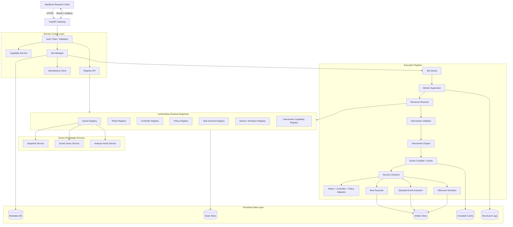

# Failure-Seeking Robot Research Platform — Server Architecture

> **문서 버전:** v0.2  
> **대상:** RunPod 기반 Simulation Execution Server  
> **Client:** MacBook 기반 Failure-Seeking Research Client  
> **주요 로봇:** Unitree G1  
> **주요 시뮬레이터:** MuJoCo  
> **설계 전제:** Client의 failure-discovery methodology는 연구 진행 중 변경될 수 있으며, Server는 특정 탐색 방법론에 종속되지 않아야 한다.

---

## 0. 이번 개정의 핵심

Server를 “현재 알고리즘을 실행하는 백엔드”가 아니라 **연구 방법론과 독립적인 simulation execution plane**으로 재정의한다.

Server가 알아야 하는 것은 다음뿐이다.

```text
어떤 revision의 scene/robot/controller/policy를 사용할 것인가?
어떤 task를 실행할 것인가?
어떤 intervention을 적용할 것인가?
어떤 raw evidence와 artifact를 기록할 것인가?
```

Server는 아래를 판단하지 않는다.

- 왜 이 candidate가 선택되었는가
- 다음 candidate는 무엇인가
- 어떤 search algorithm이 더 좋은가
- 어떤 failure case가 연구적으로 가장 흥미로운가
- LLM hypothesis가 타당한가

이 판단은 Client 연구 계층의 책임이다.

---

# 1. Server의 연구적 역할

## 1.1 핵심 역할

1. Scene, robot, controller, policy, task schema의 authoritative registry 제공
2. Client 추론을 위한 metadata/snapshot/query 제공
3. generic intervention의 authoritative validation과 적용
4. 재현 가능한 MuJoCo rollout 실행
5. raw states, actions, contacts, observations, policy trace 기록
6. 표준적인 execution facts와 event signals 계산
7. video/log/trajectory/reproduction artifact 제공
8. job isolation, retry, cancellation과 storage 관리

## 1.2 Server의 비목표

- failure hypothesis generation
- search/optimization
- final failure score
- research-specific root cause classification
- failure case ranking
- experiment branch 비교
- 논문 분석
- 특정 hierarchical/LLM/surrogate method에 맞춘 endpoint 제공

---

# 2. 핵심 설계 원칙

## 2.1 Methodology-Neutral Execution Contract

API는 `adversarial_search`, `LLM_candidate` 같은 특정 method 용어를 core contract에 포함하지 않는다.

대신 generic contract를 사용한다.

```text
ResourceRefs
+ TaskSpec
+ InterventionSpec
+ ExecutionSpec
+ RecordingSpec
+ Opaque ResearchContext
```

`ResearchContext`는 추적을 위해 저장하지만 Server가 해석하지 않는다.

## 2.2 Authoritative Versioned Registries

다음 resource는 Server가 source of truth다.

- Scene
- Robot profile
- Controller
- Policy
- Task schema
- Sensor profile
- Renderer profile
- Intervention capability

모든 resource는 ID와 immutable revision을 가진다.

## 2.3 Raw Evidence First

Server는 최종 research label보다 raw evidence를 우선 보존한다.

예:

- `qpos`, `qvel`, `ctrl`
- base pose/velocity
- contacts/forces
- high-level commands
- policy outputs
- task progress
- camera timestamps
- termination facts
- system/runtime logs

Client가 나중에 failure definition을 바꿔도 raw evidence로 다시 평가할 수 있어야 한다.

## 2.4 Standard Events와 Research Labels 분리

Server가 제공할 수 있는 표준 event:

- base height threshold crossing
- tilt threshold crossing
- contact event
- progress stalled
- target entered
- numeric instability
- controller exception

그러나 “이것이 연구적으로 어떤 failure mechanism인가”는 Client evaluator가 결정한다.

## 2.5 Immutable Base Resource + Derived Execution State

- base scene package는 immutable
- intervention은 derived scene/state를 생성
- 원본을 직접 수정하지 않음
- derived cache는 content-addressed
- rollout request와 resource revision으로 재현

## 2.6 Process Isolation

하나의 invalid scene, controller crash, OpenGL failure가 API process와 다음 experiment를 망가뜨리지 않도록 worker/subprocess를 분리한다.

## 2.7 Capability Discovery

Client methodology가 변하므로 Server는 현재 지원 기능을 machine-readable하게 제공해야 한다.

---

# 3. 전체 Server 아키텍처



---

# 4. Client–Server 책임 경계

| 항목 | Client | Server |
|---|---|---|
| Research method | 결정 | 모름 |
| Candidate choice | 결정 | 모름 |
| Failure definition | 버전 관리 | 표준 event만 |
| Scene metadata local mirror | 관리 | authoritative 제공 |
| Scene 원본/compiled model | 선택적 analysis copy | 관리 |
| Robot/controller/policy metadata mirror | 관리 | authoritative 제공 |
| Intervention intent | 생성 | 검증·적용 |
| Scene query 계획 | 결정 | 계산 |
| Physics | 없음 | 실행 |
| Policy inference | 요청 profile 선택 | 실제 inference |
| Raw evidence | 다운로드·장기 분석 | 생성 |
| Standard event | 수신 | 생성 |
| Research label | 생성 | 생성하지 않음 |
| Failure archive | 관리 | 없음 |
| Reproducibility runtime facts | 저장 | 생성 |

---

# 5. Authoritative Registry Architecture

```text
RuntimeRegistry
├── SceneRegistry
├── RobotRegistry
├── ControllerRegistry
├── PolicyRegistry
├── TaskSchemaRegistry
├── SensorProfileRegistry
├── RendererProfileRegistry
└── InterventionCapabilityRegistry
```

모든 registry item은 다음 공통 envelope를 가진다.

```json
{
  "resource_type": "scene",
  "resource_id": "scene_001",
  "revision": "sha256:...",
  "status": "READY",
  "schema_version": "1.0",
  "metadata": {},
  "compatibility": {},
  "created_at": "...",
  "deprecated": false
}
```

## 5.1 Registry Snapshot

Client가 한 번에 동기화할 수 있도록 제공한다.

```http
GET /api/v1/registry/snapshot
```

응답에는 전체 asset이 아니라 ID, revision, status, compatibility summary가 포함된다.

```json
{
  "registry_revision": "sha256:...",
  "scenes": [],
  "robots": [],
  "controllers": [],
  "policies": [],
  "tasks": [],
  "sensors": [],
  "interventions": []
}
```

## 5.2 Revision 정책

- 기존 revision은 수정하지 않음
- 변경 시 새 revision 발급
- alias `latest`는 UI 편의용일 뿐 rollout request에는 금지
- rollout은 반드시 explicit revision 사용
- deprecated revision은 재현을 위해 일정 기간 보존

## 5.3 Compatibility

다음 compatibility relation을 제공한다.

```text
Robot ↔ Controller
Robot/Controller ↔ Policy
Policy ↔ Task
Scene ↔ Robot spawn profile
Scene ↔ Intervention type
Sensor ↔ Policy
```

Endpoint:

```http
POST /api/v1/compatibility/check
```

---

# 6. Scene Registry와 Scene Package

## 6.1 Scene package 구조

```text
/workspace/runtime/scenes/scene_001/<revision>/
├── manifest.yaml
├── base_scene.xml
├── visual/
│   ├── scene.glb
│   └── textures/
├── collision/
│   ├── floor.obj
│   ├── walls.obj
│   └── furniture_lowpoly.obj
├── semantics/
│   ├── objects.json
│   ├── regions.json
│   └── relations.json
├── analysis/
│   ├── simplified_scene.glb
│   ├── point_cloud.ply
│   ├── occupancy_grid.npz
│   └── navmesh.obj
├── cameras/
│   └── cameras.yaml
├── validation/
│   ├── report.json
│   └── standing_preview.mp4
└── previews/
    └── overview.png
```

모든 analysis asset이 필수는 아니다.

## 6.2 Scene manifest

```yaml
schema_version: "1.0"
scene_id: "scene_001"
revision_inputs_version: "1.0"

coordinate_system:
  handedness: "right"
  up_axis: "Z"
  unit: "meter"

entrypoint:
  mjcf: "base_scene.xml"

bounds:
  min_m: [-5.0, -5.0, -0.2]
  max_m: [5.0, 5.0, 3.5]

spawn_points:
  - id: "g1_default"
    robot_profile_ids: ["unitree_g1/default"]
    position_m: [0.0, 0.0, 0.82]
    quaternion_wxyz: [1.0, 0.0, 0.0, 0.0]

query_capabilities:
  - get_scene_summary
  - list_objects
  - get_object_pose
  - get_aabb
  - get_objects_near
  - get_clearance
  - raycast

intervention_capabilities:
  - add_primitive
  - move_object
  - rotate_object
  - set_physics
  - set_robot_spawn
```

## 6.3 외부 3D Scene ingestion

```text
submission
→ file/security validation
→ coordinate/scale inspection
→ visual asset processing
→ collision simplification
→ semantics import/annotation
→ spawn/camera definition
→ MJCF generation
→ compile validation
→ standing smoke rollout
→ revision calculation
→ READY
```

최초에는 admin CLI를 우선 사용한다.

```bash
simulation-server scene submit /path/to/scene_package
simulation-server scene validate <submission_id>
simulation-server scene register <submission_id>
```

추후 admin API를 추가할 수 있다.

## 6.4 Scene Snapshot

Client가 failure reasoning에 사용할 compact representation이다.

```http
GET /api/v1/scenes/{scene_id}/snapshot?revision=<revision>
```

포함:

- bounds
- coordinate system
- semantic objects
- regions
- spawn points
- cameras
- query/intervention capabilities
- analysis asset descriptors

## 6.5 Analysis Asset

```http
GET /api/v1/scenes/{scene_id}/analysis-assets
```

Server는 signed artifact reference를 반환한다. Client가 필요한 asset만 선택적으로 다운로드한다.

---

# 7. Robot Registry

## 7.1 Robot package

```text
/workspace/runtime/robots/unitree_g1/default/<revision>/
├── manifest.yaml
├── model/
│   ├── robot.xml
│   └── meshes/
├── profiles/
│   ├── geometry.json
│   ├── collision_envelope.json
│   └── nominal_state.npz
├── sensors/
│   └── sensors.yaml
└── validation/
    └── report.json
```

## 7.2 Robot profile metadata

- height and bounding envelope
- nominal base height
- foot dimensions
- joint names/limits
- supported sensor profiles
- compatible controllers
- supported initial-state interventions
- recording schema
- profile revision

Client가 hypothesis를 생성할 수 있도록 non-sensitive geometry summary를 제공한다.

---

# 8. Controller Registry와 Policy Registry

## 8.1 Controller Adapter

```python
class ControllerAdapter(Protocol):
    adapter_id: str
    revision: str

    def initialize(self, runtime_context) -> None: ...
    def reset(self, seed: int, config: dict) -> None: ...
    def accept_high_level_command(self, command) -> None: ...
    def step(self, observation, sim_time: float) -> "LowLevelAction": ...
    def diagnostics(self) -> dict: ...
    def close(self) -> None: ...
```

초기 adapter:

1. `mock_standing`
2. `scripted_forward`
3. `groot_locomotion`
4. 향후 다른 controller

## 8.2 Policy Adapter

```python
class PolicyAdapter(Protocol):
    adapter_id: str
    revision: str

    def initialize(self, resources, config) -> None: ...
    def reset(self, seed: int) -> None: ...
    def infer(self, observation, task) -> "HighLevelCommand": ...
    def trace(self) -> dict: ...
    def close(self) -> None: ...
```

Policy는 scripted, VLM planner, VLA, GR00T 등으로 교체할 수 있다.

## 8.3 분리 이유

Failure가 다음 중 어디서 발생했는지 연구하려면 분리가 필수다.

```text
scene/task interaction
perception
policy/planning
controller
physics/contact
```

Server는 각 adapter의 output과 diagnostics를 별도 trace로 기록해야 한다.

---

# 9. Task Schema Registry

Task는 string instruction만 보내지 않고 schema로 정의한다.

예:

```json
{
  "task_schema_id": "navigate_to_pose",
  "version": "1.0",
  "required_fields": [
    "target_pose",
    "success_tolerance_m"
  ],
  "compatible_policy_action_spaces": [
    "velocity_command",
    "navigation_goal"
  ]
}
```

Task instance:

```json
{
  "schema": "navigate_to_pose@1.0",
  "instruction": "Walk to the red target.",
  "parameters": {
    "target_pose": {
      "position_m": [3.0, 0.0, 0.0],
      "quaternion_wxyz": [1.0, 0.0, 0.0, 0.0]
    },
    "success_tolerance_m": 0.35
  }
}
```

---

# 10. Generic Intervention Architecture

## 10.1 최상위 모델

```text
InterventionSpec
├── scene
├── task
├── robot_initial_state
├── dynamics
├── sensors
├── controller_config
└── policy_config
```

Server는 Client method 이름이 아니라 intervention operation을 처리한다.

## 10.2 Handler interface

```python
class InterventionHandler(Protocol):
    operation_id: str
    handler_version: str
    phase: str  # PRE_COMPILE, POST_COMPILE, PRE_RESET, RUNTIME

    def validate(self, context, operation) -> list["Issue"]: ...
    def apply(self, context, operation) -> None: ...
    def describe_effect(self) -> dict: ...
```

## 10.3 Scene intervention

- add primitive
- add mesh
- move/rotate/scale object
- remove/disable object
- material/friction
- light
- terrain parameter
- visibility asset

## 10.4 Task intervention

- target pose
- time limit
- success tolerance
- instruction
- task stage

## 10.5 Initial-state intervention

- robot spawn
- initial yaw
- joint perturbation
- dynamic object pose
- payload

## 10.6 Dynamics intervention

- friction
- mass
- damping
- actuator delay/noise
- external force profile

## 10.7 Sensor intervention

- camera pose/FOV
- observation latency
- noise model
- frame drop schedule
- occlusion mask

## 10.8 Controller/Policy config intervention

허용된 whitelist parameter만 수정한다. arbitrary Python code나 command execution은 금지한다.

## 10.9 Compile phase

```text
PRE_COMPILE
- body/geom/mesh 구조 변경

POST_COMPILE
- model parameter 수정

PRE_RESET
- qpos, pose, initial state

RUNTIME
- disturbance, sensor dropout, scheduled changes
```

---

# 11. Intervention Validation

## 11.1 Validation 계층

```text
Schema validation
→ capability validation
→ resource revision validation
→ semantic/object validation
→ geometry/physics validation
→ compile validation
→ initial-state overlap check
→ short stability precheck
```

## 11.2 Validation 결과

```json
{
  "valid": false,
  "issues": [
    {
      "severity": "ERROR",
      "code": "INITIAL_ROBOT_OVERLAP",
      "operation_id": "op_001",
      "message": "The obstacle intersects the G1 initial collision envelope."
    }
  ]
}
```

## 11.3 Valid하지만 극단적인 candidate

Failure research에서는 위험하거나 이상한 조건 자체가 연구 대상일 수 있다. 따라서 Server validation은 “실패를 유도할 것 같은 조건”을 막지 않는다.

막아야 하는 것은:

- 실행 불가능
- schema invalid
- numeric invalid
- resource missing
- simulator corrupt
- security violation

연구적으로 비현실적인 조건은 `warning` 또는 metadata로 남기고 Client protocol이 포함/제외를 결정한다.

---

# 12. Derived Scene와 Cache

Cache key:

```text
sha256(
  scene_revision
  + robot_revision
  + canonical_precompile_interventions
  + compiler_version
)
```

구조:

```text
/workspace/runtime/cache/compiled_scenes/<cache_key>/
├── model.mjb
├── derived_manifest.json
├── canonical_interventions.json
├── compile_report.json
└── preview.png
```

Runtime-only intervention은 cache key의 compile portion에는 포함하지 않지만 reproduction manifest에는 포함한다.

---

# 13. Rollout Contract

## 13.1 요청 envelope

```json
{
  "schema_version": "1.0",
  "client_request_id": "req_001",
  "research_context": {
    "experiment_id": "exp_001",
    "candidate_id": "cand_018",
    "method_instance_id": "method_004",
    "opaque_tags": ["clearance", "turning"]
  },
  "resources": {
    "scene": {
      "id": "scene_001",
      "revision": "sha256:..."
    },
    "robot": {
      "id": "unitree_g1",
      "profile_id": "default",
      "revision": "sha256:..."
    },
    "controller": {
      "id": "groot_locomotion",
      "revision": "git:..."
    },
    "policy": {
      "id": "scripted_navigation",
      "revision": "git:..."
    }
  },
  "task": {},
  "interventions": [],
  "execution": {
    "seed": 42,
    "physics_timestep_s": 0.002,
    "control_hz": 50,
    "maximum_duration_s": 20.0,
    "settling_duration_s": 1.0
  },
  "recording": {
    "state_trajectory": true,
    "action_trajectory": true,
    "contact_events": true,
    "policy_trace": true,
    "camera_streams": ["overview"],
    "video": "on_standard_event"
  }
}
```

Server는 `research_context`를 저장만 하고 실행 논리에 사용하지 않는다.

## 13.2 상태

```text
QUEUED
RESOLVING_RESOURCES
VALIDATING_INTERVENTIONS
PREPARING_MODEL
INITIALIZING_RUNTIME
RUNNING
FINALIZING_EVIDENCE
RENDERING
SUCCEEDED
FAILED
CANCELLED
```

## 13.3 Result

```json
{
  "job_id": "job_...",
  "execution": {
    "valid": true,
    "status": "SUCCEEDED",
    "termination_reason": "MAX_DURATION",
    "determinism_level": "BEST_EFFORT"
  },
  "task_facts": {
    "target_reached": false,
    "final_target_distance_m": 1.71
  },
  "standard_events": [
    {
      "event_type": "BASE_HEIGHT_THRESHOLD_CROSSED",
      "timestamp_s": 6.41,
      "measurements": {}
    }
  ],
  "summary_metrics": {},
  "artifacts": [],
  "reproduction": {}
}
```

Server는 기본 result에 “최종 연구 failure score”를 넣지 않는다.

---

# 14. MuJoCo Execution Runtime

## 14.1 Episode lifecycle

```text
resolve resources
→ validate revisions
→ load/compile derived model
→ initialize MjData
→ apply pre-reset interventions
→ initialize robot/controller/policy
→ settling
→ episode loop
    ├─ collect observation
    ├─ policy inference
    ├─ controller step
    ├─ apply control
    ├─ scheduled runtime interventions
    ├─ mj_step
    ├─ record raw data
    ├─ extract standard events
    └─ evaluate neutral termination
→ finalize artifacts
→ release resources
```

## 14.2 Neutral termination

Server가 지원할 neutral termination:

- maximum duration
- target reached
- explicit Client termination rule
- numeric invalid state
- controller/policy exception
- optional standard safety event

실험별 failure interpretation은 Client가 수행한다.

## 14.3 Process model

권장 MVP:

```text
FastAPI process
    ↓ durable job record
Worker supervisor
    ↓ one rollout subprocess
MuJoCo/EGL/controller/policy
```

rollout subprocess 종료 시 GPU/OpenGL/MuJoCo resource가 정리된다.

성능이 필요해지면 warmed worker pool을 추가한다.

---

# 15. Raw Evidence Recorder

## 15.1 기록 채널

### State trajectory

- simulation time
- qpos/qvel
- base pose
- base velocity
- joint states
- object poses
- task state

### Action trajectory

- policy high-level command
- controller target
- MuJoCo control vector

### Contacts

- geom/body IDs
- force/impulse
- contact position/normal
- forbidden pair flag가 아닌 raw pair

### Policy trace

- input timestamp
- output
- confidence/logits 선택
- inference latency
- model diagnostics

### Sensor trace

- frame timestamp
- camera calibration reference
- dropped frame
- noise/latency intervention state

### Runtime events

- intervention application
- controller reset
- numeric warning
- cache hit
- termination

## 15.2 Recording profile

Artifact 규모를 통제하기 위해 profile을 registry로 제공한다.

```text
minimal
standard
research_full
vision_full
```

Client는 experiment protocol에서 profile을 선택하거나 필드를 override한다.

---

# 16. Standard Event Extractor

Server event는 가능한 한 객관적 측정 사실이어야 한다.

예:

```text
BASE_HEIGHT_THRESHOLD_CROSSED
TILT_THRESHOLD_CROSSED
CONTACT_STARTED
CONTACT_ENDED
HIGH_IMPULSE_CONTACT
TARGET_REGION_ENTERED
PROGRESS_STALLED
JOINT_LIMIT_NEAR
NUMERIC_INSTABILITY
POLICY_TIMEOUT
CONTROLLER_EXCEPTION
```

각 event rule에는 version이 있다.

```json
{
  "event_extractor_id": "locomotion_standard_events",
  "version": "1.1.0"
}
```

Client가 이 event를 사용하지 않고 raw trajectory로 자체 evaluator를 돌릴 수도 있다.

---

# 17. Scene Query Service

## 17.1 기본 query

- get_scene_summary
- list_objects
- get_object_pose
- get_aabb
- get_obb
- get_objects_near
- get_clearance
- raycast
- get_spawn_candidates
- get_region

## 17.2 확장 query

- traversability
- support surface
- shortest path
- visibility
- reachability
- signed distance
- collision candidates

## 17.3 Query contract

모든 query는 다음을 포함한다.

- scene ID/revision
- optional robot profile
- coordinate frame
- parameters
- query implementation/version

Response에도 query implementation version을 기록한다. geometry algorithm이 바뀌면 연구 provenance에 영향을 줄 수 있기 때문이다.

---

# 18. Artifact Storage

## 18.1 경로

```text
/workspace/runtime/outputs/jobs/<job_id>/
├── request.json
├── canonical_request.json
├── resolved_resources.json
├── intervention_report.json
├── execution_result.json
├── summary_metrics.json
├── standard_events.jsonl
├── state_trajectory.parquet
├── action_trajectory.parquet
├── contacts.parquet
├── policy_trace.parquet
├── sensor_trace.parquet
├── runtime_events.jsonl
├── final_state.npz
├── overview.mp4
├── thumbnail.png
├── worker.log.jsonl
└── reproduction.json
```

## 18.2 Artifact API

Client에는 filesystem path를 노출하지 않는다.

```http
GET /api/v1/artifacts/{artifact_id}
```

대용량 artifact는 range request 또는 signed download를 지원할 수 있다.

## 18.3 Retention

- raw metrics/events: 기본 유지
- failure video: Client 요청 정책에 따라 유지
- success video: 선택적
- temporary frames: encoding 후 삭제
- deprecated scene/controller/policy revision: reproduction policy에 따라 보존
- cache: LRU 정리 가능하지만 source resource는 삭제하지 않음

---

# 19. Job Manager와 Idempotency

## 19.1 Idempotency

```http
POST /api/v1/rollouts
Idempotency-Key: <uuid>
```

같은 key와 같은 payload hash:

- 기존 `job_id` 반환

같은 key와 다른 payload hash:

- `409 IDEMPOTENCY_CONFLICT`

## 19.2 Queue와 concurrency

초기:

```text
max_concurrent_rollouts = 1
```

이유:

- controller/GPU memory 안정화
- deterministic debugging
- artifact corruption 방지

후속:

- resource profile별 queue
- GPU policy 사용 여부
- video renderer concurrency
- scene compile concurrency

## 19.3 Recovery

Server 재시작 시:

- QUEUED job 복구
- RUNNING이었던 job은 `INTERRUPTED` 또는 retry policy 적용
- partial artifact 검증
- idempotent resubmission 허용

---

# 20. API Surface

## 20.1 System

```http
GET /api/v1/health
GET /api/v1/capabilities
GET /api/v1/schemas
```

## 20.2 Registry

```http
GET /api/v1/registry/snapshot
GET /api/v1/scenes
GET /api/v1/scenes/{scene_id}
GET /api/v1/scenes/{scene_id}/snapshot
GET /api/v1/scenes/{scene_id}/analysis-assets
GET /api/v1/robots
GET /api/v1/robots/{robot_id}/profiles/{profile_id}
GET /api/v1/controllers
GET /api/v1/policies
GET /api/v1/tasks
POST /api/v1/compatibility/check
```

## 20.3 Query

```http
POST /api/v1/scenes/{scene_id}/queries
```

## 20.4 Rollout

```http
POST /api/v1/rollouts
GET /api/v1/rollouts/{job_id}
GET /api/v1/rollouts/{job_id}/result
POST /api/v1/rollouts/{job_id}/cancel
```

## 20.5 Assets

```http
HEAD /api/v1/assets/by-sha256/{sha256}
POST /api/v1/assets
GET /api/v1/assets/{asset_id}
```

## 20.6 Artifact

```http
GET /api/v1/artifacts/{artifact_id}
```

## 20.7 Admin/ingestion — optional

```http
POST /api/v1/admin/scenes/submissions
GET /api/v1/admin/scenes/submissions/{submission_id}
POST /api/v1/admin/scenes/submissions/{submission_id}/register
```

---

# 21. Capability Response

```json
{
  "contract_versions": ["1.0"],
  "registry_revision": "sha256:...",
  "scene_queries": [],
  "intervention_operations": [
    {
      "operation_id": "add_primitive",
      "version": "1.0",
      "phase": "PRE_COMPILE",
      "schema": {}
    }
  ],
  "robots": [],
  "controllers": [],
  "policies": [],
  "tasks": [],
  "recording_channels": [],
  "render_profiles": [],
  "limits": {
    "maximum_episode_duration_s": 120,
    "maximum_interventions": 100,
    "maximum_upload_bytes": 1073741824,
    "maximum_parallel_jobs": 1
  }
}
```

---

# 22. Reproduction Manifest

```json
{
  "job_id": "job_...",
  "request_sha256": "...",
  "canonical_request": {},
  "resolved_resources": {
    "scene_revision": "...",
    "robot_revision": "...",
    "controller_revision": "...",
    "policy_revision": "..."
  },
  "runtime": {
    "server_version": "...",
    "contract_version": "1.0",
    "python_version": "...",
    "mujoco_version": "...",
    "torch_version": "...",
    "cuda_runtime": "...",
    "gpu": "...",
    "host_image": "..."
  },
  "randomness": {
    "master_seed": 42,
    "simulator_seed": 42,
    "policy_seed": 42
  },
  "execution": {
    "physics_timestep_s": 0.002,
    "control_hz": 50
  },
  "artifact_hashes": {}
}
```

---

# 23. RunPod 배치

```text
/workspace/runtime/
├── registries/
│   ├── scenes/
│   ├── robots/
│   ├── controllers/
│   ├── policies/
│   └── tasks/
├── assets/
├── huggingface/
├── cache/
│   ├── compiled_scenes/
│   ├── mujoco/
│   └── model_runtime/
├── outputs/
│   └── jobs/
├── db/
│   └── simulation_server.sqlite
├── logs/
└── tmp/

/workspace/g1_failure/
└── simulation-server/
```

환경 변수:

```bash
SIM_SERVER_DATA_ROOT=/workspace/runtime
SIM_SERVER_DB_PATH=/workspace/runtime/db/simulation_server.sqlite
SIM_SERVER_API_KEY=...
MUJOCO_GL=egl
HF_HOME=/workspace/runtime/huggingface
XDG_CACHE_HOME=/workspace/runtime/cache
```

---

# 24. 권장 저장소 구조

```text
simulation-server/
├── pyproject.toml
├── src/simulation_server/
│   ├── main.py
│   ├── config.py
│   ├── api/
│   ├── contracts/
│   ├── capabilities/
│   ├── registries/
│   │   ├── base.py
│   │   ├── scene.py
│   │   ├── robot.py
│   │   ├── controller.py
│   │   ├── policy.py
│   │   ├── task.py
│   │   └── snapshot.py
│   ├── ingestion/
│   ├── scene_knowledge/
│   │   ├── snapshots.py
│   │   ├── queries.py
│   │   └── analysis_assets.py
│   ├── interventions/
│   │   ├── base.py
│   │   ├── registry.py
│   │   ├── validator.py
│   │   ├── scene.py
│   │   ├── task.py
│   │   ├── initial_state.py
│   │   ├── dynamics.py
│   │   ├── sensors.py
│   │   ├── controller.py
│   │   └── policy.py
│   ├── compile/
│   ├── jobs/
│   ├── runtime/
│   ├── robots/
│   ├── controllers/
│   ├── policies/
│   ├── recording/
│   ├── events/
│   ├── rendering/
│   ├── storage/
│   ├── security/
│   └── observability/
├── tests/
└── scripts/
```

---

# 25. Security

- bearer API key 또는 private endpoint
- TLS
- asset upload content hash
- path traversal 차단
- arbitrary code/config injection 차단
- controller/policy parameter whitelist
- request/artifact size limit
- subprocess shell 사용 최소화
- internal path/stack trace 미노출
- uploaded mesh parsing은 isolated process 권장
- admin ingestion endpoint는 일반 rollout key와 분리

---

# 26. Observability

필수 log context:

```text
job_id
client_request_id
experiment_id
candidate_id
scene_id/revision
robot/controller/policy revision
worker_id
execution_phase
event
duration
error_code
```

필수 operational metric:

- queue length
- active worker
- job duration
- compile cache hit rate
- worker crash count
- GPU memory
- disk free
- artifact bytes
- scene compile failure rate
- policy inference latency

---

# 27. 테스트 전략

## 27.1 Registry Tests

- immutable revision
- snapshot correctness
- compatibility
- deprecated resource resolution
- missing revision failure

## 27.2 Intervention Tests

각 handler 공통 test:

- schema
- unsupported operation
- phase
- canonicalization
- validation
- deterministic apply
- reproduction serialization

## 27.3 Runtime Tests

- plane + G1 load
- standing
- forward command
- target task
- raw recorder
- contact event
- EGL render
- worker timeout/crash recovery

## 27.4 Contract Tests

Client와 공통 schema package를 사용한다.

- registry snapshot
- rollout request/result
- error envelope
- idempotency
- artifact metadata
- capability negotiation

## 27.5 Research Integrity Tests

- raw evidence가 evaluator 없이도 저장됨
- standard event version 기록
- research_context가 execution에 영향을 주지 않음
- 같은 candidate의 repeat가 별도 seed로 기록됨
- infrastructure error가 valid task failure로 반환되지 않음

---

# 28. 구현 마일스톤

## S0 — Contracts, Health, Capabilities

- 공통 contract
- `/health`
- `/capabilities`
- directory/config/logging

**완료 조건:** Mac Client가 contract/capability negotiation을 수행한다.

## S1 — Versioned Registries

- scene/robot/controller/policy/task registry
- registry snapshot
- compatibility
- immutable revision

**완료 조건:** Client가 모든 runtime resource를 local catalog로 동기화한다.

## S2 — Scene Ingestion and Snapshot

- external scene package
- validation
- scene snapshot
- optional analysis asset
- standing preview

**완료 조건:** 확보한 3D scene이 `READY` revision으로 등록된다.

## S3 — Reproducible Standing Rollout

- job lifecycle
- G1 spawn
- mock standing
- raw recorder
- reproduction manifest

**완료 조건:** revision-pinned standing rollout을 실행한다.

## S4 — Rendering and Artifact

- EGL
- camera profile
- MP4
- artifact endpoint

**완료 조건:** Mac에서 rollout 영상을 다운로드한다.

## S5 — Controller/Policy Adapters

- scripted forward
- Groot locomotion
- policy trace
- adapter diagnostics

**완료 조건:** high-level command와 low-level controller trace를 분리 기록한다.

## S6 — Generic Intervention Engine

- scene
- task
- initial state
- dynamics
- capability registry
- authoritative validation

**완료 조건:** obstacle 전용 코드 없이 generic intervention을 처리한다.

## S7 — Scene Query Service

- object/pose/AABB
- nearby
- clearance
- raycast
- versioned implementation

**완료 조건:** Client world model 구축에 필요한 query를 제공한다.

## S8 — Standard Events and Full Evidence

- base/tilt/contact/progress events
- state/action/contact/policy traces
- recording profile

**완료 조건:** Client가 failure definition을 독립적으로 다시 계산할 수 있다.

## S9 — Robustness

- subprocess isolation
- recovery
- cancellation
- idempotency
- retention
- 100 rollout soak test

**완료 조건:** 잘못된 candidate나 worker crash 후에도 다음 job을 처리한다.

---

# 29. 첫 번째 End-to-End 연구 시나리오

## 공통 runtime

- `scene_001`
- Unitree G1
- Groot locomotion controller
- navigate-to-pose task
- revision-pinned resources
- full state/action/contact event
- failure 시 video

## Client 방법론

Server 입장에서는 알 필요 없지만 Client는 세 방법을 실행한다.

- random
- Sobol
- manual

## Server가 받는 차이

세 방법 모두 동일한 generic contract를 보낸다.

```text
같은 ResourceRefs
+ 같은 TaskSpec
+ 서로 다른 InterventionSpec
+ 각기 다른 opaque ResearchContext
```

따라서 후속에 LLM/hierarchical/surrogate method가 추가되어도 Server 수정이 필요 없어야 한다.

---

# 30. Server MVP 완료 정의

- [ ] Scene/robot/controller/policy/task가 versioned registry에 있다.
- [ ] Client가 registry snapshot을 동기화할 수 있다.
- [ ] scene snapshot과 robot profile metadata를 제공한다.
- [ ] 외부 3D scene을 validation 후 등록한다.
- [ ] revision-pinned G1 standing rollout을 실행한다.
- [ ] controller와 policy trace를 분리 기록한다.
- [ ] generic InterventionSpec을 검증·적용한다.
- [ ] scene query를 versioned response로 제공한다.
- [ ] raw state/action/contact/policy evidence를 저장한다.
- [ ] 표준 event와 research label을 분리한다.
- [ ] video/artifact를 Client에 제공한다.
- [ ] reproduction manifest를 생성한다.
- [ ] invalid scene/controller crash를 task failure와 구분한다.
- [ ] method 이름이나 failure score에 의존하지 않는다.
- [ ] idempotency와 recovery가 동작한다.
- [ ] 100회 순차 rollout soak test를 통과한다.

---

# 31. Code Agent 구현 지침

1. API보다 먼저 shared contract와 resource revision model을 정의한다.
2. registry를 단순 filesystem scan이 아니라 explicit manifest와 revision으로 구현한다.
3. Server code에 `hierarchical_search`, `failure_agent`, `LLM` 같은 연구 method dependency를 넣지 않는다.
4. final failure score를 Server에 하드코딩하지 않는다.
5. raw recorder와 reproduction manifest를 초기 milestone에 포함한다.
6. obstacle-specific endpoint 대신 generic intervention handler를 구현한다.
7. scene query implementation version을 response에 기록한다.
8. controller와 policy를 별도 adapter로 유지한다.
9. rollout을 subprocess로 격리한다.
10. RunPod persistent volume 외부에 중요한 registry/artifact를 저장하지 않는다.
11. 실시간 viewer보다 offscreen MP4와 raw evidence를 우선한다.
12. 첫 vertical slice 완료 전 distributed queue와 복잡한 GPU parallelism을 도입하지 않는다.

---

# 32. 최종 구조의 한 문장 정의

> RunPod Server는 versioned scene·robot·controller·policy registry, generic intervention engine, MuJoCo execution runtime과 raw evidence recorder를 제공하며, Client의 failure-discovery 방법론이 어떤 형태로 변경되더라도 동일한 재현 가능한 execution contract로 로봇 실패 연구를 지원하는 Methodology-Neutral Simulation Execution Plane이다.
