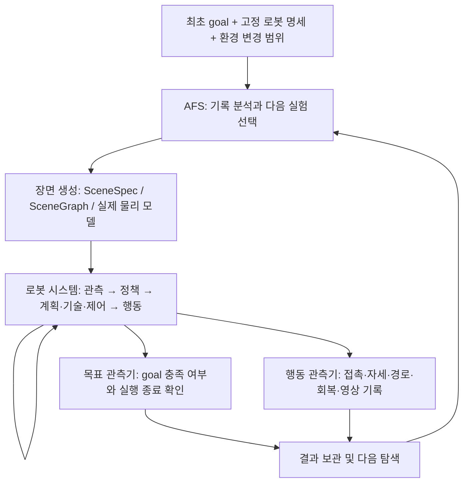

# Goal 달성 여부를 기준으로 하는 AFS 재설계

작성: 2026-09-26 UTC. 상태: **핵심 평가기·행동 관측·AFS v2 후보 선택 구현 반영.**
현재 적용 범위와 아직 남은 항목은 [구현 현황](GOAL_OUTCOME_AFS_IMPLEMENTATION.md)을 따른다.
아래 설계 전체가 완료되었다는 의미는 아니다. 자동 campaign/재개·기하 확장은 후속 단계다.
이 문서는 목표·실패 의미와 다음 개발 방향의 기준이며, 과거 결과의 판정을 소급 변경하지 않는다.

## 1. 평가할 질문

> 주어진 환경에서, 고정된 로봇 시스템이 자신이 선택한 방법으로 최초 goal을
> 정해진 실행 예산 안에 달성하는가? 그렇지 않으면 어떤 환경 조건에서 미달하는가?

AFS의 목적은 재현 가능한 목표 미달 조건, 성공/실패 전이 구간, 서로 다른 행동상 원인을
찾는 것이다. 동일 실패를 더 극단적으로 만드는 횟수나 접촉 이벤트 수를 목적 함수로 삼지 않는다.

평가 대상 S는 로봇 모델·관측·정책·내부 계획기·가용 기술·제어기 전체다. 환경 θ, 최초 목표 G,
실행 예산 B, 실행 변동 ξ에 대해 측정할 결과는 `GoalReached(S, θ, G, B, ξ)`다.
주장 범위는 이 S/G/B 조건에 한정한다. 제한된 실험으로 무제한 시간의 불가능성을 증명하지 않는다.

‘어떠한 방법’은 S에 실제 설치된 능력을 조합해 우회·밀기·재시도·회복 등을 선택한다는 뜻이다.
G1의 현 push adapter가 집기/점프를 지원하지 않는 사실은 로봇 시스템의 능력 명세에 적는다.
AFS가 새 기술을 대신 구현하거나 선택할 경로·중간 목표를 로봇에게 지정하지 않는다.

## 2. 소유권과 전체 흐름



| 구성 요소 | 결정하는 것 | 출력 |
|---|---|---|
| TaskContract | 최초 goal, 허용 오차, 달성 유지 시간, 에피소드 예산 | 버전과 해시가 있는 평가 계약 |
| RobotSystem | 목표까지의 전략, 내부 경로, 속도, 기술 선택, 자체 제약에 대한 대응 | 행동 및 실행 상태 |
| AFS | 허용 범위 안의 환경 조건, 반복·경계·대조 실험 배정 | 후보 장면과 검증할 가설 |
| Simulator | 물리 상태의 변화 | 실제 접촉·움직임·센서 |
| GoalEvaluator | 실제 상태가 최초 goal을 충족했는지 | 목표 결과 |
| BehaviorObserver | 실행 과정에서 무엇이 일어났는지 | 시간·물체 ID가 있는 사건과 지표 |
| RunSupervisor | 실행 예산·프로세스·수치 유효성 관리 | 종료 사유·유효성·비용 |

로봇 GPT와 AFS GPT는 동일 모델을 사용해도 입력과 메모리가 분리된다. AFS의 실패 가설,
평가기의 미래 정보·정답 경로는 로봇 입력에 전달하지 않는다. 로봇의 원래 관측 조건에
전체 지도/GT pose가 포함되는 것은 허용하며 해당 조건을 실험 중 고정한다.
AFS가 시뮬레이터 전체 기록을 사후 분석하는 것은 가능하다.

## 3. Goal 계약과 결과 판정

첫 적용의 TaskContract는 현재 최초 goal을 그대로 표현한다.

```yaml
schema_version: task-goal-v1
task_id: reach_destination
goal:
  entity: robot_base
  frame: world_m
  target_xy_m: [7.0, 0.0]
  radius_m: 0.25
  dwell_s: 1.0
evaluation_profile: goal_outcome_v1
episode_budget:
  max_robot_policy_calls: 10
  max_simulation_s: null
  inference_wait_counts_as_simulation_time: true
```

これは設計例であり、現 CLI がこの YAML を読み込めるという意味ではない。
現在の10回という呼び出し予算を継承し、120秒上限を再導入しない。比較条件として
予算を変える場合は別の実験契約にする。AFSが候補ごとに予算を変えることは認めない。
呼び出し回数は計画照会・観測・移動を含むので、「10回の移動」とは異なる。

到達方法、箱の最終配置、足跡経路、常時直立、2D経路の存在はこの goal に追加しない。
例えば途中で倒れても回復して到達すれば成功。常時直立や物体無損傷が本来の依頼に
必要なら、その要件を別途 TaskContract に明記してから試験する。

| 終了時の観測 | task_outcome | 扱い |
|---|---|---|
| 有効状態で goal の条件を満たした | PASS | 過程の接触や途中の技術失敗で上書きしない |
| 事前に定めたエピソード予算が終了し、goal 未達 | FAIL | その予算での目標未達 |
| ロボット自身が実行終了/放棄を宣言し、goal 未達 | FAIL | Sの終端判断による目標未達 |
| 評価側の中断、キャンセル、数値破綻等で結果が観測不能 | INCONCLUSIVE | ロボット失敗率の分母に入れない |
| 候補の物理モデル生成不成立や初期状態契約不成立 | NOT_RUN | INVALID_SCENEとして生成側に返す |

GoalEvaluator はシミュレータの実測状態を使う。GPTの「成功した」という説明や、
一度の push success、planner の path_found を最終 goal 達成の代わりにしない。
最後のポリシー呼び出しに対応する許可済みの行動と内部処理まで実行して評価する。
明示した mission simulation budget が尽きた場合は、推論待ち中でも有効な時間経過なら
FAIL とする。物理シミュレーション自体が壊れた場合は INCONCLUSIVE とする。

API異常は発生源を保持する。初期キー未設定/サービス接続不能で試験が成立しない場合、
ベンチ側のシリアライズ不具合等は実験障害として扱う。ロボットに元来備わる再試行・
停止仕様を実行し尽くして終了した場合は S の終端として評価する。障害を見つけるたびに
都合のよい分類へ変えず、比較プロトコルで所有範囲を固定する。環境要因との関係も未確認と記す。

## 4. 接触・転倒・技術失敗の扱い

現コードでは単一の `failed` が接触違反・落下・到達・異常をまとめてループ終了させている。
新設計では `goal_reached`、`robot_terminal`、`budget_exhausted`、`execution_valid` と
イベント記録を別々に持つ。目標到達という結果を最後に発生したイベント名で上書きしない。

| 現在のイベント | goal_outcome_v1での動作 |
|---|---|
| 手と箱の接触、壁接触、手や胴体と床の接触 | 接触イベントを記録し実行継続 |
| 一時的な転倒や姿勢異常 | 状態と回復経過を観測し、Sが次の行動を選ぶ |
| pushの時間切れ・位置誤差・release未達 | 技術の結果をSに返し、次の行動/停止はSが決める |
| plannerのno_path | Sへの情報。全戦略でgoal不能という判定に使わない |
| robot内の既存の力制限/姿勢制御/コマンド拒否 | Sの実装として動作し、その応答を記録 |
| ベンチ実装の接触・力・転倒の一律即時終了 | goalのみを評価するプロファイルから除く |
| NaN/Inf、壊れた物理状態、プロセス喪失 | 実行中断してINCONCLUSIVE |

接触判定で停止しない場合も衝突形状・接触力・重力・摩擦は通常通りシミュレーションする。
物体をすり抜けたりteleportさせる変更ではない。既存の手の後退や中立位置復帰制御は
RobotSystemの行動として残る。今回の再設計だけでその動作性能を改善したとは言わない。
ベンチの早期終了を単に「ロボット内部の停止」と呼び替えて従来判定を残さない。

20260926T130019_070486Zではpush_handoff中に左手検指と箱が再接触した。
新プロファイルなら接触を記録し、Sに次の判断機会または残りの予算を与える。
過去の停止後の軌跡は存在しないため、その記録から新プロファイルの結果を補完しない。
過去の`valid_execution=true`は旧規則で実行できたという意味で、新規則の完走証拠ではない。

## 5. 何をAFSに観測させるか

各実験を一つの時系列として保存する。継続時間の長い接触をtickごとの別失敗に数えない。

- 最初のgoal、時刻付きgoal距離・到達維持時間、task_outcomeと終了主体。
- 観測→GPTの行動→技術の開始/終了→再観測の時刻対応、推論待ち・姿勢ドリフト。
- 接触開始/終了、ロボット部位/物体ID、段階、最大法線力・力積、侵入距離。
  同時接触がある場合はper-contact値と集計値を明示する。
- 手と対象の距離、押した距離、指示した距離、解除・引き継ぎの経過。
- 足の接触・接線速度、ロボット姿勢・角速度・高さ、進捗停止と回復。
- 設定摩擦と実際の接触係数。global floor変更が足と箱の両方に作用することを記録。
- 全体MP4/GIF、ロボットが見た画像、イベント前後の短い画像列、動画時刻への参照。

LLM入力はgoal結果、代表イベント、成功/失敗の比較、具体的な値と根拠IDを優先する。
画像はログでは説明しづらい姿勢/接触場面を補う。全動画を無制限に毎回送信する設計にはしない。
画像入力追加は今後の実装項目であり、現behavior AFS v1は数値・テキストのみ。
画像から「滑った」と見えた場合も仮説として出力し、接線速度などの実測と照合する。

観測事実・競合説明・未知項目を同じ文章に混ぜない。例えば「押し幅不足」を事実、
「重すぎる/手が滑る/接触時間不足/戦略が合わない」を別の仮説として保持する。
姿勢角だけから転倒までの余裕を計算したことにはしない。

## 6. 次の実験の選択

LLMは次に確かめる因果仮説と環境変更空間を提案し、ホストは範囲・重複・予算・物理反映を検証する。
LLMの自己申告確率は校正された失敗確率として使わない。

| 選択 | 目的 | 例 |
|---|---|---|
| 成功側への探索 | 失敗条件を緩和して成功が現れるか確認 | 重い条件でgoal未達→より軽い複数条件 |
| 境界の精密化 | 比較可能な成功と失敗の間を調べる | 同一robot/goal/budgetの両側条件と中間値 |
| 競合説明の対照 | 同じ現象を説明する別の原因を検証 | 同じ質量で摩擦、同じ摩擦で質量を変更 |
| 相互作用の確認 | 一変数で説明できない要因を検査 | 質量2水準×摩擦2水準の比較 |
| 新しい環境領域 | 未探索の行動・環境条件を試す | 回転区間、別の障害物配置、地形の組合せ |
| 再実行 | 偶発性と再現性を確かめる | 同一場面のgoal達成回数と失敗経路の比較 |

「常に現在値の上下を両方試す」「毎回ちょうど2軸」はv1の便宜的制約なので廃止する。
重すぎるという仮説なら軽い側に複数点を置ける。下限にいる場合も他の領域へ移れる。
成功側/失敗側の向きは仮説であり、下げると必ず簡単になるという単調性を仮定しない。

予算8 rolloutの初期配分例は、成功側/境界2、競合説明2、新領域2、再実行2。
これは設定可能な初期案で、全枠が有効評価の費用を消費する。必要な成功例がないときは
境界枠を成功側探索へ、同一条件の結果が割れるときは再実行へ配分する。
独立した新領域探索を確保し、局所的な失敗に全予算を費やさない。

同じ場面近傍で目標未達が繰り返され、行動と結果に新しい情報が増えない場合は探索を休止する。
休止対象は「その軸全体」ではなく、条件領域と根拠のある行動パターンの組合せ。
新たな成功隣接点・別の相互作用・未検証の対照が見つかったときに再開する。
文章だけ言い換えた仮説を新しい失敗機構として数えない。機構IDは暫定分類で根拠を保持する。

境界は単発のPASS/FAILで確定しない。まず両側を少数反復（初期案各3回）し、
goal達成数/試行数と未確定性を示す。結果が割れるなら追加反復し、予算が尽きたら
不確実なまま残す。外部GPTの完全な決定性は仮定せず、モデル名・応答情報・時刻を記録する。
戦略の違いも含むロボットシステム全体の境界であり、固定push動作の機械的限界と混同しない。

提案レコードには `parent_runs`, `evidence_refs`, `question`, `hypothesis`,
`alternative`, `mode`, `changed_axes`, `space/representatives`, `held_fixed`,
`expected_physical_effect`, `compare_with`, `repeat_plan`, `falsification` を持たせる。
意味の検証に加え、提案自体・却下理由・スケジューラの選択理由も保存する。

## 7. 環境制御と有効性

現在接続済みの箱質量・箱摩擦・床摩擦を最初の実行可能範囲とする。値の変更が
意図した物理変化を起こすかを候補生成時/実行時に確認する。例えば箱摩擦.5→.25でも
箱と床の実効摩擦.8が変わらないなら「箱滑走抵抗の低下は実現しなかった」と記す。
手と箱の接触など別の作用まで同じとは限らないため、場面全体の完全な重複と決めつけない。

次の拡張は移動可能障害物の位置/大きさ、通路幅、曲がり角、局所摩擦、傾斜・段差、
その後に動く障害物や一定時間だけ通過可能な環境。scene/source-of-truthから
graph/map/XML/観測を一緒に更新し、実際の物理とグラフを一致させる。

「急いで動いて姿勢を崩す」仮説では、旋回が必要な配置などを提示し、ロボットが
本当に急動作を選ぶか観測する。AFSがロボットの速度を上書きしたり、候補ごとにgoalや
期限を短くして急がせることはしない。動的環境もあらかじめ固定した許容範囲で動かす。

静的2D地図でno_pathでも、可動障害物の移動や別の行動でgoalに到達し得る。
その理由だけで候補をINVALID_SCENEにしない。初期物体貫通・欠損目標・壊れた物理は
生成不成立として扱う。全戦略で解けない場面と証明できる場合は「既知の実現不能条件」
として別枠に保存し、ロボット固有の脆弱性発見とは区別する。対象ロボットが失敗した
だけでその場面を実現不能に分類しない。判定できなければfeasibility=unknownと記録する。

## 8. 結果契約と再現

旧 `success/reason/valid_execution` だけでは失敗・中断・イベントの意味が混ざる。
新しい結果は以下を基本とする。

```json
{
  "schema_version": "task-outcome-v1",
  "evaluation_profile": "goal_outcome_v1",
  "task_outcome": "FAIL",
  "goal_reached": false,
  "termination": {"actor": "episode_budget", "reason": "POLICY_CALL_BUDGET"},
  "execution_valid": true,
  "goal_distance_m": 3.7,
  "events_summary": {"unexpected_hand_box_contact": 1},
  "robot_condition_sha256": "...",
  "task_contract_sha256": "...",
  "scene_revision": "..."
}
```

このJSONは形式例であり過去runの再判定値ではない。INCONCLUSIVEではgoal未観測を
falseと確定させず `goal_reached: null` を許す。eventの有無とgoal結果は独立して表示する。
実行条件にはSのコード・資産・モデル・プロンプト・観測・予算・評価器版を含める。
AFS側とロボット側のモデル呼び出し・トークン・wall/sim時間を別々に記録する。

キャンペーンは提案・生成・実行・評価を個別IDで保存し、再開時に完了実行を再送しない。
未完了実行はAPI/GPU状態を調査して中断/復帰を記録する。重複場面と意図的な反復を区別する。
従来通りruntime配下にprotocol、場面、生ログ、MP4/GIF、判定、仮説・対照を保存する。

## 9. 実装への移行順序

1. **GoalEvaluatorを独立化。** 純粋な判定契約を作り、goal_runnerの`failed`連鎖を
   明示した終了状態へ変更。`goal_outcome_v1`と過去`legacy_guarded`を版で区別する。
   旧記録は保存し、新コードで原本場面を再実行する。Mock/live表示の固定文言も修正する。
2. **BehaviorObserverを充実。** 全接触の力・段階・ID、回復、時間を記録し、
   behavior.summarizeに事実と根拠付き時系列を渡す。動画/画像の参照時刻を揃える。
3. **AFSの選択を情報獲得へ変更。** v1の常時両側2軸制約を置き換え、成功側・
   境界・対照・新領域・反復とその履歴を保存。実効物理変化の検査を追加する。
4. **候補→実行→再提案を連結。** 実験予算、逐次GPU実行、保存/再開、コストを管理。
   ロボットからAFSへの観測の流れだけをつなぎ、AFSがロボットの途中行動を指定しない。
5. **環境領域の拡張と比較。** 同じS/G/B/生成範囲でRandom/Sobolと比較。
   goal失敗率、境界の狭まり/再現性、行動パターンの多様性、無効率、総費用を報告する。

数値だけのunit確認に加え、実装段階で次のケースを完了基準として検証する。
手が箱に触れても後でgoal達成ならPASS、pushが未達でも別の戦略で到達ならPASS、
倒れて回復後に到達ならPASS、予算終了まで到達しなければFAIL、数値異常で継続不能なら
INCONCLUSIVE。これらは新仕様であり現コードが既に通るという意味ではない。

根拠: 既存[行動AFS](BEHAVIOR_AFS.md)、[ロボット実行](ROBOT_GOAL_AGENT.md)、
[push統合](ROBOT_PUSH_INTEGRATION.md)、[現在の時間予算](ROBOT_SIMULATION_BUDGET.md)。
2026-09-26 후속 구현은 별도 작업 이력에 기록했다. 기존 기록의 판정은 보존하며,
새 평가 의미의 CPU 통합 테스트와 실제 GPT/GPU 성능 검증을 구분한다.
